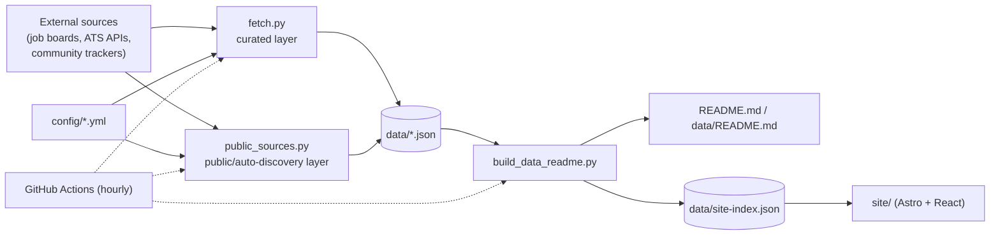

# Contributing to tracker

This file is for anyone who wants to understand, run, or extend the pipeline behind [the job list](data/README.md). If you're just here to find a job, you don't need any of this — head back to [README.md](README.md).

**Tech stack:** Python 3.11+ (stdlib only) · GitHub Actions · Astro · React · TypeScript · Tailwind CSS

## Architecture



| Component | Role |
|---|---|
| [scripts/fetch.py](scripts/fetch.py) | Curated layer — 17 sources, filtered by `config/companies_allowlist.yml` |
| [scripts/public_sources.py](scripts/public_sources.py) | Public layer — ATS auto-discovery plus hand-seeded boards |
| [scripts/build_data_readme.py](scripts/build_data_readme.py) | Merges both feeds, renders the READMEs and `site-index.json` |
| [config/](config/) | Allowlist, board tokens, events — the extension point, plain YAML |
| [data/](data/) | Generated JSON + Markdown, committed by the hourly workflow |
| [site/](site/) | Astro + React frontend, fetches `data/*.json` at runtime |

Full diagram set (sequence, component dependencies, CI/CD, data model): [docs/DIAGRAMS.md](docs/DIAGRAMS.md). Narrative deep-dive: [docs/ARCHITECTURE.md](docs/ARCHITECTURE.md).

## How it works

1. **Fetch** — filtered by `config/companies_allowlist.yml`:
   - `scripts/fetch.py` — Remotive, ArbeitNow, SimplifyJobs, speedyapply, zapplyjobs, hanzili, negarprh/Canadian-Tech-Internships, ambicuity, LorenzoLaCorte, DereC4, Lamiiine, plus first-party APIs for Amazon, Netflix, Apple, and Germany's Arbeitsagentur.
   - `scripts/public_sources.py` — Devpost, Unstop, Devfolio, HackerEarth, Luma; Greenhouse/Lever/Workday (auto-discovered); Ashby/SmartRecruiters/PinpointHQ/Workable/Recruitee/BambooHR/Freshteam/Teamtailor (hand-seeded in `config/extra_job_boards.yml`, Freshteam via HTML scrape — no JSON API exists for it); a hand-maintained events list (`config/events.yml`) plus confs.tech's open conference-data JSON, deduplicated against it.
   - Every apply link is checked before publishing; dead ones move to the archive automatically.
   - Every published row is validated against `config/job-entry.schema.json` / `config/public-entry.schema.json` — a shape drift fails the run instead of shipping bad data.
   - Full source list with links: [SOURCES.md](SOURCES.md).
2. **Build** — `scripts/build_data_readme.py`:
   - Renders `README.md` and `data/README.md` from the raw JSON in `data/`.
   - Writes `data/site-index.json` — both feeds flattened into one checksummed file.
   - Appends one snapshot per run to `data/stats-history.json` (90-day cap) — a trend line built forward hourly.
   - Renders 11 preset RSS feeds to `data/feeds/*.xml` via `scripts/rss_feeds.py` (fixed presets, not arbitrary saved filters — arbitrary filtered XML on demand needs a server this project doesn't have).
3. **Publish** — [hourly-global-roles.yml](.github/workflows/hourly-global-roles.yml) runs the pipeline hourly, opens a PR with whatever changed, and auto-merges it. No manual steps.

Every [workflow run](https://github.com/AhmedNassar7/tracker/actions/workflows/hourly-global-roles.yml) that changes anything opens and merges its own PR — the merged-PR history doubles as a changelog.

## Ways to contribute

- **Track one more company** on a platform we already support (Ashby, SmartRecruiters, PinpointHQ, Workable, Recruitee, BambooHR, Freshteam, or Teamtailor) — add its board token to `config/extra_job_boards.yml`. Greenhouse, Lever, and Workday companies need no config at all; they're picked up automatically the first time one of their postings shows up from another source.
- **Add a tech/career event** (conference, summit, career fair) — add one line to `config/events.yml` (`Name | Organizer | City, Country | YYYY-MM-DD | URL`). Past-dated events are hidden automatically, so for an annual event just bump its date each year.
- **Change which companies are accepted** — edit `config/companies_allowlist.yml`. Both of these are plain YAML lists, no coding required.
- **Add a brand-new job board/API** (like Remotive or SimplifyJobs) — this needs a short fetcher function in `scripts/fetch.py` or `scripts/public_sources.py`, since each API has its own shape. Check whether the source has a JSON API before writing an HTML scraper — several sources that look like plain GitHub READMEs actually have one (see `scripts/fetch.py`'s `ambicuity` fetcher for an example).

Not comfortable writing YAML or Python? [Open an issue](https://github.com/AhmedNassar7/tracker/issues/new/choose) with the company or board name and someone will add it. Found a bug, a dead link, or wrong data? Same place — pick "Bug report" — or use the "Feedback / report a bug" link in the site footer.

## Running it locally

### The pipeline

No dependencies to install — everything is Python standard library (3.11+).

```bash
python scripts/fetch.py              # curated sources -> data/jobs-global*.json
python scripts/public_sources.py     # public board sources -> data/public-opportunities.json
python scripts/build_data_readme.py  # renders README.md and data/README.md from the JSON above

python tests/test_net.py
python tests/test_fetch.py
python tests/test_patterns.py
python tests/test_public_sources.py
python tests/test_schema_validation.py
python tests/test_site_index.py
python tests/test_stats_history.py
python tests/test_rss_feeds.py
```

### The site

The [site/](site/) folder is the Astro frontend, deployed to GitHub Pages. It fetches `data/*.json` at runtime from `main` (`src/lib/dataSource.ts`) rather than generating it — `npm run dev` shows real, live data with no local pipeline run needed. Needs Node.js 22.12+.

```bash
cd site
npm install       # first time only
npm run dev       # dev server at localhost:4321
npm run build     # production build to site/dist/
```

To work offline or against your own local pipeline output instead, copy the JSON files you want (e.g. `data/site-index.json`) into `site/public/` — `dataSource.ts` falls back to that same-origin copy in dev only.

Pull requests run through [CI](.github/workflows/ci.yml) automatically — every test file needs to pass before merging.

## Deployment

Two independent deploys, both automatic — no manual step under normal use:

| Workflow | Trigger | What it does |
|---|---|---|
| [hourly-global-roles.yml](.github/workflows/hourly-global-roles.yml) | Hourly cron | Runs the pipeline, opens and auto-merges a PR with whatever changed |
| [ci.yml](.github/workflows/ci.yml) | Push / pull request | Runs all 8 test files |
| [deploy-site.yml](.github/workflows/deploy-site.yml) | Push to `site/**` | Builds the Astro site, deploys to GitHub Pages |

Full breakdown (steps, secrets, how to verify a run, how to trigger one manually): [docs/DEPLOYMENT.md](docs/DEPLOYMENT.md).

## Repository layout

| Path | What's in it |
|---|---|
| [data/README.md](data/README.md) | The combined, human-readable table of every open opportunity |
| [SOURCES.md](SOURCES.md) | Every website/repo/API the pipeline pulls from, with links |
| [data/resources.md](data/resources.md) | Hand-curated career resources: coding practice, mock interviews, resume tools, and more |
| [data/](data/) | Raw JSON the tables above are generated from — see [Source Files](data/README.md#source-files) |
| [config/companies_allowlist.yml](config/companies_allowlist.yml) | Which companies' listings are accepted (edit this, no coding required) |
| [config/extra_job_boards.yml](config/extra_job_boards.yml) | Ashby/SmartRecruiters/PinpointHQ/Workable/Recruitee/BambooHR/Freshteam/Teamtailor companies to track (edit this, no coding required) |
| [config/events.yml](config/events.yml) | Tech/career events — conferences, summits, career fairs (edit this, no coding required) |
| [config/job-entry.schema.json](config/job-entry.schema.json) | JSON Schema for each record in `data/jobs-global.json` / `jobs-global-archive.json` |
| [config/public-entry.schema.json](config/public-entry.schema.json) | JSON Schema for each record in `data/public-opportunities.json` (jobs/hackathons/events share one shape, disambiguated by `kind`) |
| [config/site-index.schema.json](config/site-index.schema.json) | JSON Schema for each item in `data/site-index.json`, the flattened combined view of both feeds |
| [config/stats-history.schema.json](config/stats-history.schema.json) | JSON Schema for each snapshot in `data/stats-history.json`, the rolling per-run trend history |
| [scripts/](scripts/) | The fetch/build pipeline (Python, standard library only) |
| [tests/](tests/) | Automated tests for the pipeline scripts, run in CI on every pull request |
| [.github/workflows/](.github/workflows/) | The hourly refresh job (`hourly-global-roles.yml`), the CI test job (`ci.yml`), and the site deploy (`deploy-site.yml`) |

## Notes

- `README.md` and `data/README.md` are generated files — edits should go through `scripts/build_data_readme.py` so they survive the next automated run.
- `data/resources.md`, `SOURCES.md`, and this file are hand-maintained, not touched by the pipeline.
- `.nojekyll` at the repo root skips GitHub's default Jekyll build (unneeded here, and it can mangle `site/`'s own `index.html`); `data/*.json` stays reachable at its normal path either way.
