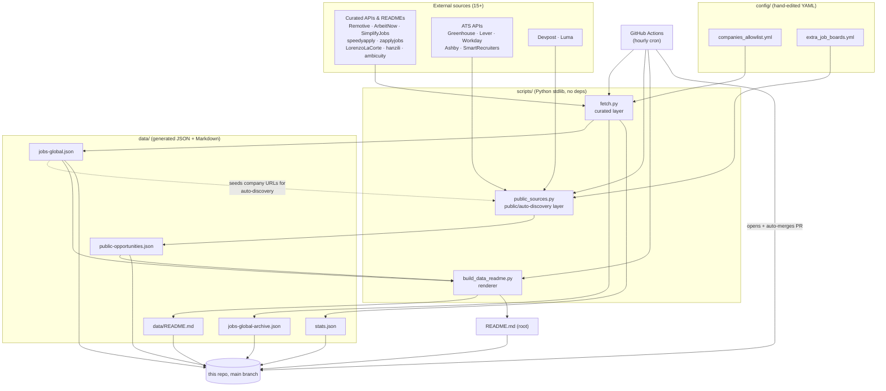
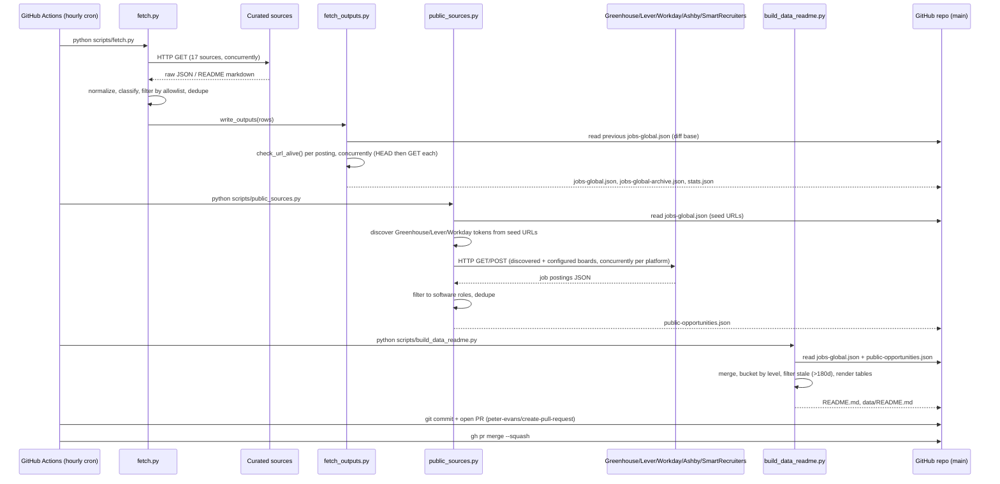
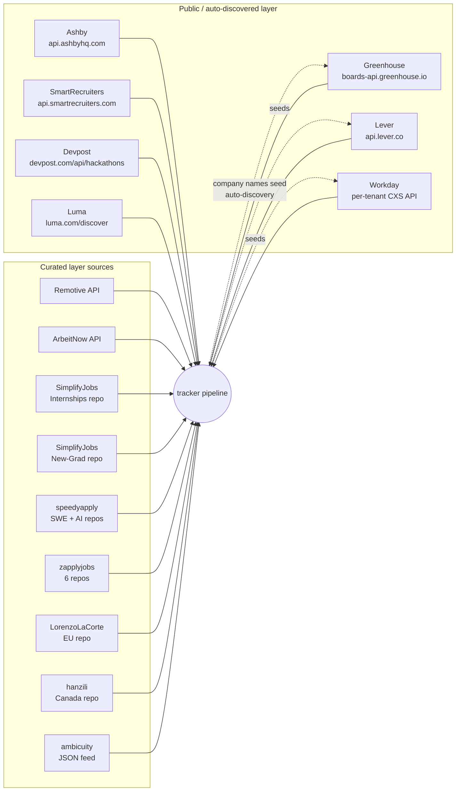

# Architecture

[← back to project overview](../README.md) · [docs index](../README.md#documentation)

## In plain English

`tracker` has no server and no database. It is a Python script pipeline that GitHub Actions runs once an hour:

1. **Fetch** — pull raw data from ~15 external sources (job-board APIs and community GitHub trackers), normalize every row into one shared shape, and filter it.
2. **Widen** — take the companies discovered in step 1, and poll their underlying ATS (Greenhouse/Lever/Workday) APIs directly for more of their open roles, plus a couple of standalone sources (hackathons, events).
3. **Build** — turn the resulting JSON into human-readable Markdown tables.
4. **Publish** — commit the changed files straight back into this repo via a pull request that auto-merges.

The "deployment target" is the repository itself: `data/*.json` and the two `README.md` files *are* the product. Anyone can read them straight off GitHub, no server required.

## System overview

## Every layer/component

| Component | File | What it does |
|---|---|---|
| Curated fetch layer | [scripts/fetch.py](../scripts/fetch.py) | Pulls 17 curated sources concurrently, normalizes each row to the shared job shape, filters by `config/companies_allowlist.yml` + level/region, dedupes, writes `jobs-global*.json` and `stats.json` |
| Shared normalization/output | [scripts/fetch_outputs.py](../scripts/fetch_outputs.py) | Diffs this run against the last, checks link liveness (concurrently, via `net.run_concurrently`), moves dead/vanished postings to the archive, only writes files when something actually changed |
| Classification patterns | [scripts/patterns.py](../scripts/patterns.py) | Central regexes for level/region/remote-type/country/role detection, shared by both fetch layers |
| Networking | [scripts/net.py](../scripts/net.py) | `fetch_with_retry` (retries transient network errors and 429/5xx HTTP responses with backoff) and `run_concurrently` (thread-pool fan-out with deterministic, order-preserving results), shared by both fetch layers |
| SimplifyJobs parser | [scripts/simplify_jobs_parser.py](../scripts/simplify_jobs_parser.py) | Parses SimplifyJobs' specific pipe-table + HTML-table README format, including multi-location `
` cells |
| Generic community-board parser | [scripts/community_board_parser.py](../scripts/community_board_parser.py) | Shape-based parser (not fixed-column) for speedyapply/zapplyjobs/hanzili/LorenzoLaCorte README tables |
| Public/auto-discovery layer | [scripts/public_sources.py](../scripts/public_sources.py) | Auto-discovers Greenhouse/Lever/Workday boards from curated job URLs, polls Ashby/SmartRecruiters from config, pulls Devpost hackathons and Luma events, writes `public-opportunities.json` |
| Public output writer | [scripts/public_outputs.py](../scripts/public_outputs.py) | Splits rows by `kind` (job/hackathon/event) and writes the combined JSON payload |
| README renderer | [scripts/build_data_readme.py](../scripts/build_data_readme.py) | Loads both JSON outputs, merges + buckets by level, filters stale (>180d) postings, renders `README.md` and `data/README.md` |
| Config | [config/](../config/) | `companies_allowlist.yml` (curated-layer gate), `extra_job_boards.yml` (Ashby/SmartRecruiters tokens), two JSON Schemas documenting the output shapes |
| Tests | [tests/](../tests/) | Assert-based test scripts for `net.py`, `fetch.py`, and `public_sources.py`, run in CI |
| Automation | [.github/workflows/](../.github/workflows/) | `ci.yml` (tests on PR/push), `hourly-global-roles.yml` (the hourly pipeline + auto-merge) |

## Data flow end to end

## External services and APIs

All 15 integrations are free-tier public APIs or public GitHub content — no paid APIs, no API keys, no `requirements.txt`.

## CI/CD pipeline

Two independent GitHub Actions workflows:

```mermaid
flowchart TD
    subgraph CI["ci.yml — on pull_request, push to main"]
        C1["Checkout"] --> C2["Set up Python 3.11"]
        C2 --> C3["python3 tests/test_fetch.py"]
        C3 --> C4["python3 tests/test_public_sources.py"]
    end

    subgraph Hourly["hourly-global-roles.yml — cron '15 * * * *' + workflow_dispatch"]
        H1["Checkout"] --> H2["Set up Python 3.11"]
        H2 --> H3["python3 scripts/fetch.py"]
        H3 --> H4["python3 scripts/public_sources.py"]
        H4 --> H5["python3 scripts/build_data_readme.py"]
        H5 --> H6["Write LAST_UPDATED timestamp"]
        H6 --> H7["peter-evans/create-pull-request\n(opens PR if anything changed)"]
        H7 --> H8{"PR created?"}
        H8 -- yes --> H9["gh pr merge --squash --delete-branch"]
        H8 -- no --> H10["nothing changed, workflow ends"]
    end
```

See [DEPLOYMENT.md](DEPLOYMENT.md) for the full trigger/job/step breakdown of both workflows.
