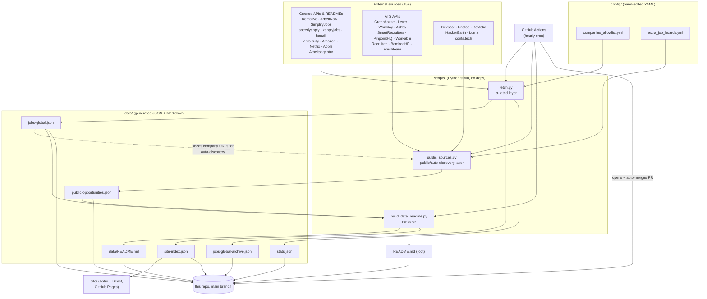
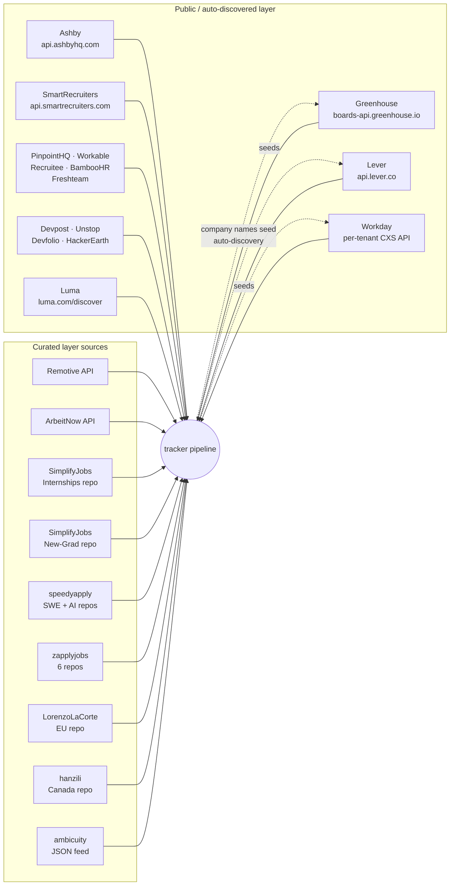

# Architecture

[← back to project overview](../README.md) · [docs index](../README.md#documentation)

## Overview

No server, no database. A Python script pipeline GitHub Actions runs hourly:

1. **Fetch** — pull ~15 external sources (job-board APIs + community GitHub trackers), normalize every row to one shape, filter.
2. **Widen** — poll the ATS (Greenhouse/Lever/Workday) APIs of companies found in step 1, plus standalone sources (hackathons, events).
3. **Build** — render the JSON into Markdown tables.
4. **Publish** — commit changed files back via an auto-merging PR.

The deployment target is the repo itself: `data/*.json` and the two `README.md` files *are* the product.

## System overview

## Every layer/component

| Component | File | What it does |
|---|---|---|
| Curated fetch layer | [scripts/fetch.py](../scripts/fetch.py) | Pulls 17 curated sources concurrently, normalizes each row to the shared job shape, filters by `config/companies_allowlist.yml` + level/region, dedupes, writes `jobs-global*.json` and `stats.json` |
| Shared normalization/output | [scripts/fetch_outputs.py](../scripts/fetch_outputs.py) | Diffs this run against the last, checks link liveness (concurrently, via `net.run_concurrently`), moves dead/vanished postings to the archive, only writes files when something actually changed |
| Classification patterns | [scripts/patterns.py](../scripts/patterns.py) | Central regexes for level/region/remote-type/country/role detection, shared by both fetch layers |
| Networking | [scripts/net.py](../scripts/net.py) | `fetch_with_retry` (retries transient network errors and 429/5xx HTTP responses with backoff) and `run_concurrently` (thread-pool fan-out with deterministic, order-preserving results), shared by both fetch layers |
| SimplifyJobs parser | [scripts/simplify_jobs_parser.py](../scripts/simplify_jobs_parser.py) | Parses SimplifyJobs' specific pipe-table + HTML-table README format, including multi-location `
` cells |
| Generic community-board parser | [scripts/community_board_parser.py](../scripts/community_board_parser.py) | Shape-based parser (not fixed-column) for speedyapply/zapplyjobs/hanzili README tables |
| Public/auto-discovery layer | [scripts/public_sources.py](../scripts/public_sources.py) | Auto-discovers Greenhouse/Lever/Workday boards from curated job URLs, polls Ashby/SmartRecruiters/PinpointHQ/Workable/Recruitee/BambooHR/Freshteam from config, pulls hackathons and events, writes `public-opportunities.json` |
| Public output writer | [scripts/public_outputs.py](../scripts/public_outputs.py) | Splits rows by `kind` (job/hackathon/event) and writes the combined JSON payload |
| README + site-index renderer | [scripts/build_data_readme.py](../scripts/build_data_readme.py) | Loads both JSON outputs, merges + buckets by level, filters stale postings, renders `README.md`, `data/README.md`, and `data/site-index.json` |
| Config | [config/](../config/) | `companies_allowlist.yml` (curated-layer gate), `extra_job_boards.yml` (ATS board tokens), JSON Schemas documenting the output shapes |
| Tests | [tests/](../tests/) | Assert-based test scripts for the pipeline modules, run in CI |
| Automation | [.github/workflows/](../.github/workflows/) | `ci.yml` (tests on PR/push), `hourly-global-roles.yml` (the hourly pipeline + auto-merge), `deploy-site.yml` (builds and deploys `site/`) |
| Website | [site/](../site/) | Astro + React frontend, deployed to GitHub Pages, fetches `data/site-index.json` at runtime — no build-time data dependency |

Full data-flow sequence diagram, CI/CD flowchart, component dependency graph, and entity-relationship diagram: [DIAGRAMS.md](DIAGRAMS.md).

## External services and APIs

All integrations are free-tier public APIs or public GitHub content — no keys, no `requirements.txt`.

## CI/CD pipeline

Three independent GitHub Actions workflows — full breakdown (steps, triggers, secrets) in [DEPLOYMENT.md](DEPLOYMENT.md), full flowchart in [DIAGRAMS.md](DIAGRAMS.md#cicd-pipeline).
