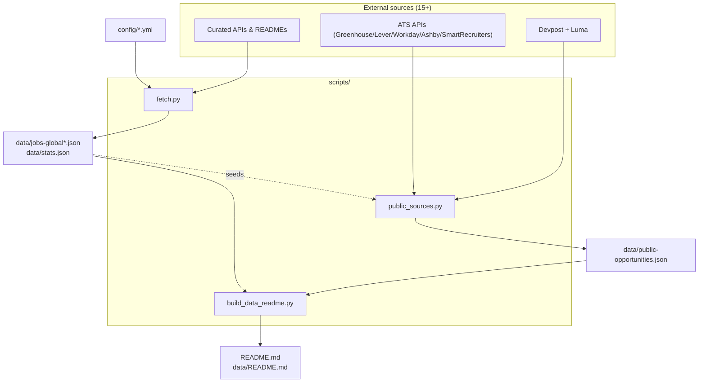
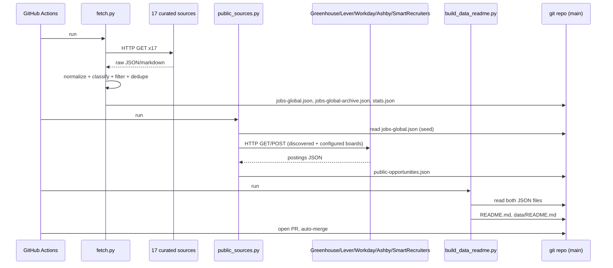
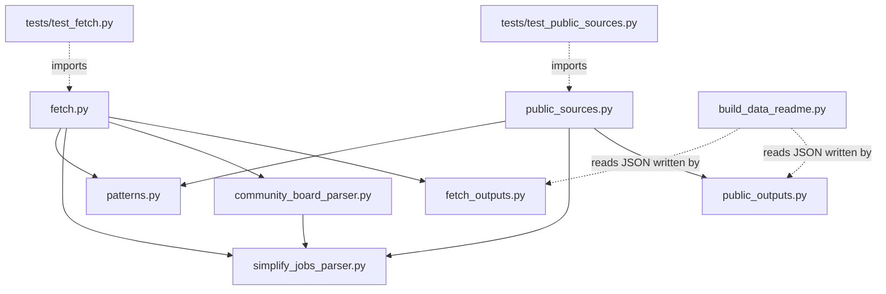
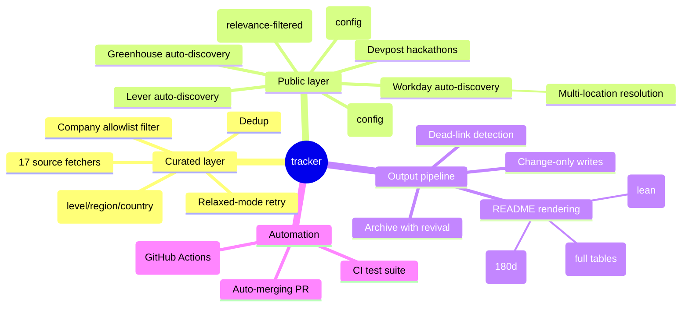
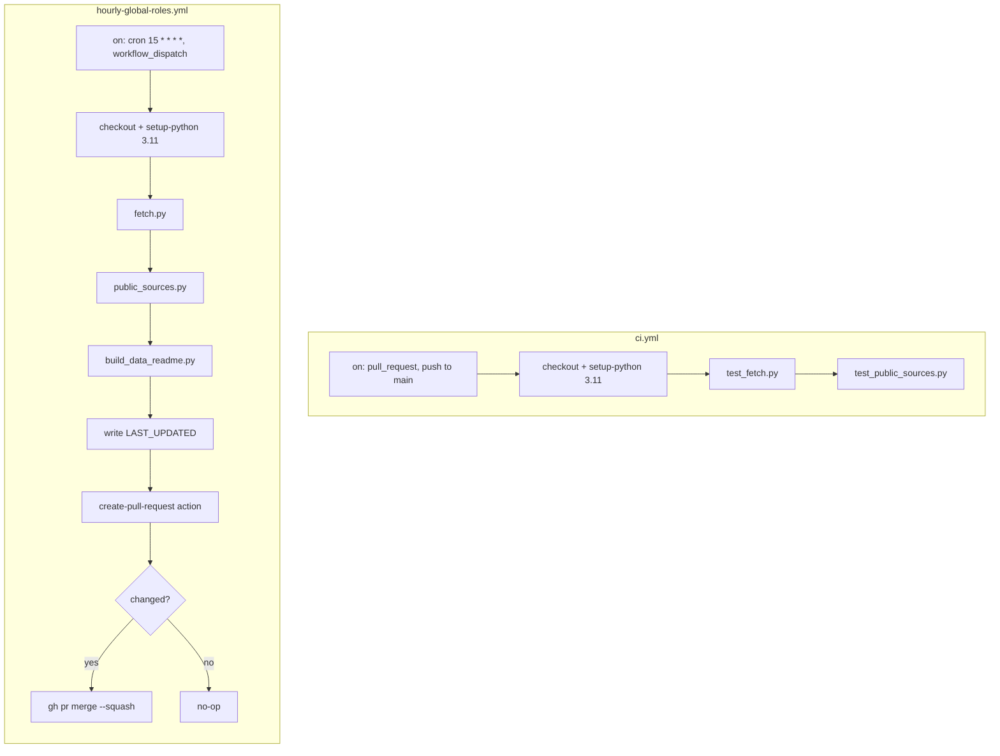
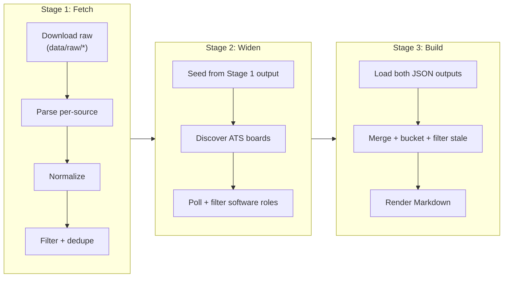
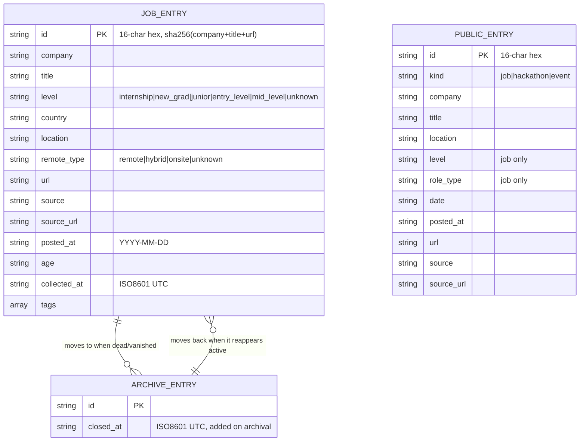
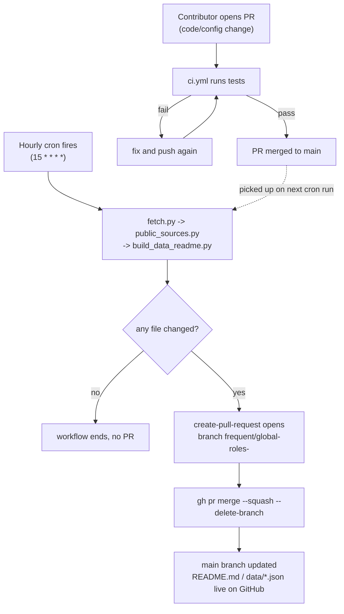

# Diagrams

[← back to project overview](../README.md) · [docs index](../README.md#documentation)

Every diagram here reflects the actual code as of this writing — nothing speculative. See [ARCHITECTURE.md](ARCHITECTURE.md) for the same diagrams in narrative context, and [FEATURES.md](FEATURES.md) for per-feature flowcharts.

## System overview

## Data / request flow (sequence diagram)

## Component / module dependencies

## Feature mind map

## CI/CD pipeline

## Data pipeline (automation/scripts project)

## Entity relationships (data model)

*(`JOB_ENTRY` = `data/jobs-global.json`, also the shape stored in `data/jobs-global-archive.json` plus `closed_at`. `PUBLIC_ENTRY` = the shared shape for all three arrays in `data/public-opportunities.json`. There is no runtime database — this is the JSON record shape, not SQL tables.)*

## Deployment flow

There is no separate hosting target — "deployment" *is* committing the generated files back to `main`. See [DEPLOYMENT.md](DEPLOYMENT.md) for the full explanation.
