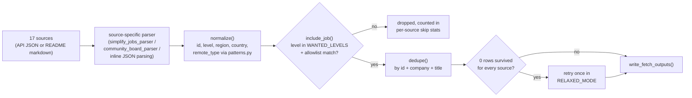
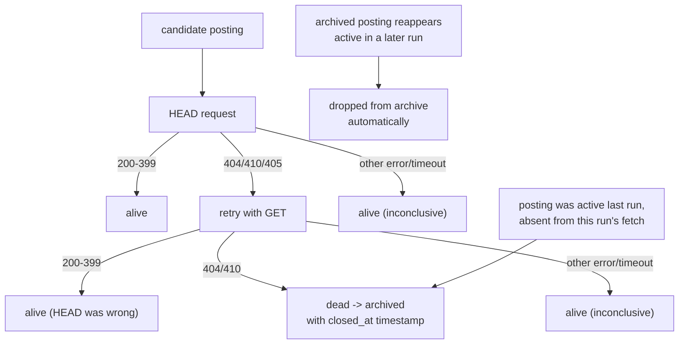
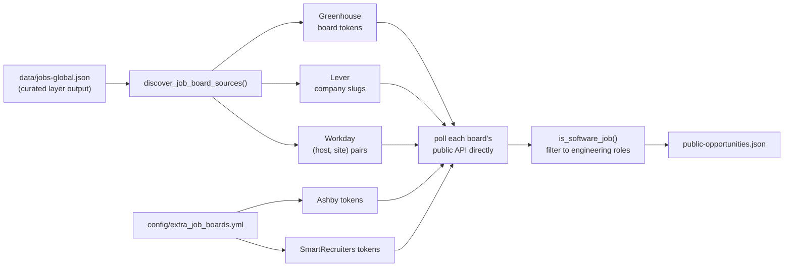
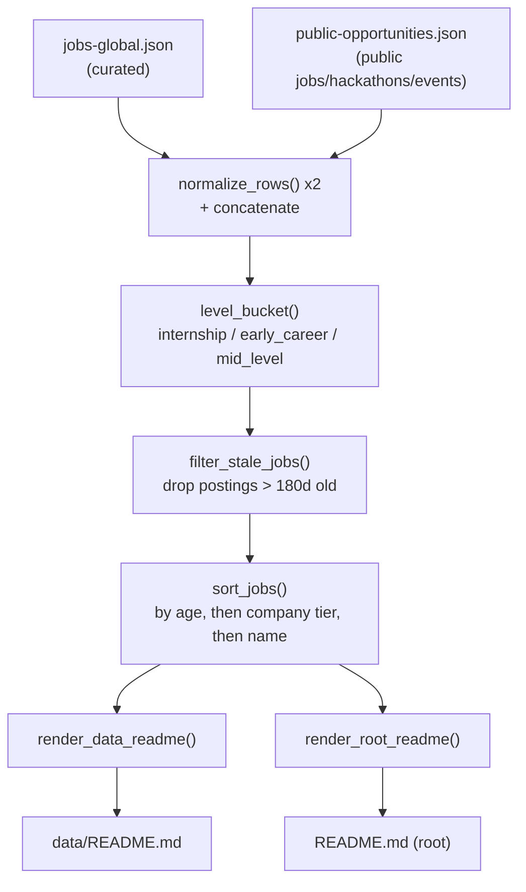

# Features

[← back to project overview](../README.md) · [docs index](../README.md#documentation)

## Curated job fetching

**Purpose:** Pull job postings from 18 hand-picked sources and keep only roles at top-tier companies, so the "Jobs" table stays high-signal instead of a firehose.

**Where it lives:** [scripts/fetch.py](../scripts/fetch.py) — one `fetch_<source>()` function per source (`fetch_remotive`, `fetch_arbeitnow`, `fetch_simplify_internships`, `fetch_simplify_newgrad`, `fetch_speedyapply_swe`/`_ai`, six `fetch_zapplyjobs_*`, `fetch_lorenzolacorte_eu`, `fetch_hanzili_canada`, `fetch_ambicuity_newgrad`, `fetch_amazon`, `fetch_netflix`), orchestrated by `main()`. `fetch_amazon` is the one exception to "third-party tracker" — it hits `amazon.jobs`'s own search API directly, since Amazon has a real, free, keyless API of its own (verified live rather than assumed).

**How it works:** Each fetcher downloads its source (JSON API or a GitHub-hosted README), parses it into `(company, title, location, url, age)` tuples, runs each through `normalize()` to attach a stable id, detected level/region/country/remote-type, then `include_job()` filters by wanted level + `config/companies_allowlist.yml`. All source lists get concatenated and deduped by `dedupe()`. If zero rows survive strict filtering, `main()` retries everything once in `RELAXED_MODE` (level `unknown` allowed, non-allowlisted companies allowed for internship/new-grad only) so a single misbehaving regex can't zero out an entire run.

## Company allowlist filtering

**Purpose:** Guarantee the curated feed only contains roles at companies worth showing, regardless of how noisy a source's own listings are.

**Where it lives:** `config/companies_allowlist.yml` (data), loaded and checked in `scripts/fetch.py` via `ALLOWLIST`, `is_allowed_company()`.

**How it works:** The YAML file is parsed by hand (no PyYAML dependency) into a flat lowercase list, ignoring category headers and comments. `is_allowed_company(company)` matches an allowlist entry as a **whole token** — bounded by a non-alphanumeric character (or string start/end) on each side — so `"Amazon"` matches `"Amazon.com Services LLC"` and `"Amazon Web Services"` but not `"Metaphor"` (a plain `"meta" in c` used to wrongly accept it as Meta, dropping a random startup into the FAANG tier).

## Classification engine

**Purpose:** Turn a free-text job title and location string into structured fields (`level`, `region`, `country`, `remote_type`) that the rest of the pipeline can filter, bucket, and sort on.

**Where it lives:** [scripts/patterns.py](../scripts/patterns.py) — regex tables shared by both `fetch.py` (`FETCH_*`) and `public_sources.py` (`PUBLIC_*`); applied via `detect_level`, `detect_region`, `detect_remote_type`, `detect_country`, `detect_role_type`.

**`detect_country` + `country_flag` (G2):** `detect_country` was curated-only; it now lives in `patterns.py` and `build_site_index` runs it over every *public*-layer job's location too, so the site's country filter isn't limited to the EU-skewed curated set — `FETCH_COUNTRY_MARK_MAP` covers ~55 countries across MENA / APAC / LATAM / wider Europe. `country_flag(name)` returns the flag emoji (Unicode regional-indicator pair from an ISO-2 map) or `""` for `Unknown` / `Remote` / anything unmapped; the site prefixes it in the location cell. `"EMEA"` is displayed as **"Europe"** — `detect_region` tests the `mena` bucket before `emea`, so the two never overlap and the old label just read as if they did.

**How it works:** Each detector runs an ordered set of `re.compile(..., re.I)` patterns against the title or location string and returns the first match's category (e.g. `internship`, `new_grad`, `junior`), or a fallback (`"unknown"` for the curated layer, `"other"` for the public layer) if nothing matches.

`detect_region` buckets a location into `us` / `canada` / `mena` / `emea` / `remote` / `unknown`. **`mena` (Middle East & Africa) is checked before `emea`** so a Gulf, Levant, North-Africa, or sub-Saharan-tech-hub location (Dubai, Riyadh, Cairo, Amman, Tel Aviv, Lagos, Nairobi, Cape Town, Istanbul, …) resolves to its own region instead of being folded into Europe. It's in `WANTED_REGIONS`, so the curated layer keeps these roles rather than filtering them out. The site exposes `mena` as a first-class facet everywhere `region` appears — `FilterBar`, `GlobalDashboard`'s "Jobs by region", the `PreferencesPanel` region chips, and "Best match" scoring — labelled **"Middle East & Africa"**. Region enums in `config/job-entry.schema.json`, `config/public-entry.schema.json`, and `config/site-index.schema.json` all carry `mena`.

## Job-facet detection (tech tags, work authorisation, salary)

**Purpose:** Pull three extra signals a candidate actually filters on — the tech stack, whether visa sponsorship / no-degree is on offer, and any disclosed pay range — straight from a posting's own description text, without ever guessing.

**Where it lives:** [scripts/patterns.py](../scripts/patterns.py) — `extract_job_facets()` → `detect_tech_tags` (≈45-entry `TECH_TAG_PATTERNS`, first-match-wins so "React Native" isn't also counted as "React"), `detect_requirements` (visa / degree / relocation), `parse_salary` (a currency-marked two-ended range, sanity-checked). Wired in by `fetch.py`'s `normalize(..., description=)` for Remotive + ArbeitNow and by `public_sources.py` for Greenhouse / Lever / Ashby; flows through `build_data_readme._site_index_entry` into `site-index.json`. Tests: [tests/test_patterns.py](../tests/test_patterns.py).

**How it works — strict-positive, never fabricated:** a facet key is added **only** when the text says so explicitly. `visa_sponsorship`/`degree_required`/`relocation` are `true`/`false` only on an explicit statement (a negative — "no visa sponsorship", "degree not required" — wins over a positive one); a posting that's simply silent gets **no key at all**, never a default `false`. `parse_salary` rejects anything that isn't a real range (single number, >10× spread, `min > max`, out-of-bounds for the detected period) rather than emit a shaky guess. The tech-tag regexes carry deliberate false-positive guards — bare "go" / "spark" / "spring" / "rust" as ordinary prose words must not tag a language — which the tests lock in.

**Where it surfaces:** the generated `data/README.md` prepends a 🛂 marker and appends an italic pay range to a job's title cell (see the "Markers" section it renders). On the site, `OpportunityTable`'s `FacetChips` renders the tech tags + a 🛂 Visa / No degree / pay-range chip row under each job, and `FilterBar` adds an "Any tech" dropdown (options = tags present in the loaded data, most-common first) plus **🛂 Visa sponsorship** and **No degree required** toggle chips — both explicit-only, matching `applyFilters`'s `=== true` / `=== false` checks.

## Dead-link detection and archiving

**Purpose:** Keep the published list free of postings whose link is actually gone, without wrongly archiving/dropping live postings just because a server mishandled one HTTP verb.

**Where it lives:** `check_url_alive()` in [scripts/net.py](../scripts/net.py), shared by both collector layers. The curated layer's archiving logic is in `write_fetch_outputs()` in [scripts/fetch_outputs.py](../scripts/fetch_outputs.py) (archives to `jobs-global-archive.json` with `closed_at`); the public layer's is in `write_public_outputs()` in [scripts/public_outputs.py](../scripts/public_outputs.py) (drops the row outright — no archive file exists for that layer).

**How it works:** For each URL, `check_url_alive` tries `HEAD` first; a `HEAD` 404/410/405 is *not* trusted on its own (observed live on Pinterest's careers site) — it retries with `GET` before declaring the link dead. Anything else (403 bot-block, timeout, DNS error) is treated as "can't tell, assume alive." Separately, a posting present in the previous run but missing from this run's fresh fetch (rolled off the source, not necessarily dead-linked) is also archived. A posting that reappears active later has its stale archive entry dropped automatically.

**Soft-404 and bot-blocked exceptions (all hand-verified):** three sites can't be judged by status code alone, so `check_url_alive` special-cases them:
- **`_SOFT_404_RULES`** — a URL-regex → dead/alive-marker table. `google.com/about/careers/.../results/*` is dead when its `og:title` is empty; `jobs.apple.com/*/details/*` and `joinbytedance.com/search/*` are dead when a server-rendered `og:title` is *absent* entirely (a live posting always has one, an expired one falls back to a generic shell). Add a rule only after confirming the marker by hand against real live-vs-expired pages.
- **LinkedIn** — `linkedin.com/jobs/view/<id>` apply links (e.g. the whole `lorenzolacorte_eu` feed) are bot-blocked on the page itself, so `check_url_alive` fetches LinkedIn's unauthenticated guest fragment instead. It treats "No longer accepting applications" / a 404 as dead — and, unlike every other case, an *inconclusive* read (bot-block, empty fragment, timeout) after 3 retries also resolves to **dead**, not alive. LinkedIn scraped links are the lowest-trust input and go stale within days; a curated-layer archive is reversible, so the row returns automatically once LinkedIn answers again.

**Persistent liveness cache → the "Verified open" signal (A1).** `resolve_link_liveness()` (in `net.py`) records every URL it confirms alive, with a timestamp, into `data/link-cache.json` (`{url: {alive: true, at}}`, positive results only, 12h TTL, 7-day prune) — this is mainly a wall-clock optimisation (skip re-checking ~3,000 URLs that were fine an hour ago). `build_site_index()` also reads it: each `site-index.json` item gets `liveness` (`verified` if its raw URL is in the cache as alive, `unverified` otherwise) and, when verified, `last_checked`. `unverified` is **not** "dead" — a confirmed-dead link is already archived/dropped by the time this file is written; it just means "not in the cache" (new, inconclusive, or aged out). The site's `OpportunityTable` renders a positive-only **"Verified open · checked 34 min ago"** badge for `liveness === "verified"` jobs and nothing for the rest — mirroring the community boards' ✅ column, where absence is silence, not a red flag.

## Schema validation on write

**Purpose:** Guarantee every row this pipeline publishes actually matches the JSON Schema it claims to (`config/job-entry.schema.json` / `config/public-entry.schema.json`), so a coding bug or an unexpected upstream value fails the run loudly instead of silently shipping malformed data to whatever reads these files next (the planned site, most directly).

**Where it lives:** [scripts/schema_validator.py](../scripts/schema_validator.py) (the validator itself — dependency-free, no `jsonschema` package, matching this repo's stdlib-only rule), called from `write_fetch_outputs()` in `fetch_outputs.py` and `write_public_outputs()` in `public_outputs.py`.

**How it works:** A small draft-07 subset — `type`, `enum`, `pattern`, `format: uri`, `required`, and `additionalProperties: false` — is enough to cover everything the two schema files actually use, without a general JSON Schema implementation. Both write functions validate every row immediately before writing; any error raises `ValueError` with up to 20 specific messages logged first, which — combined with the hourly workflow's `set -euo pipefail` — aborts that run entirely rather than opening a PR with bad data. No workflow YAML changes were needed for this: validation lives inside the same `fetch.py`/`public_sources.py` runs the hourly workflow already calls.

## Change-only output writes

**Purpose:** Avoid noisy commits/PRs — the hourly workflow should only open a PR when the published data actually changed.

**Where it lives:** `write_fetch_outputs()` in [scripts/fetch_outputs.py](../scripts/fetch_outputs.py).

**How it works:** Each new row is compared against the previous run's row with the same `id` via a content signature (`_job_signature`, JSON of the meaningful fields, sorted keys) that deliberately excludes noisy fields like `age`/`collected_at`. If every row's signature and the active-file ordering are unchanged, the function logs "No job changes detected" and returns without touching any file on disk — so an hour with zero real changes produces zero git diff.

## Public / auto-discovery layer

**Purpose:** Widen coverage far beyond the curated allowlist by polling the actual ATS (applicant tracking system) APIs behind companies already seen in the curated feed — no manual company list needed for the three biggest ATS platforms.

**Where it lives:** [scripts/public_sources.py](../scripts/public_sources.py) — `discover_job_board_sources()`, `fetch_greenhouse_board_jobs`, `fetch_lever_jobs`, `fetch_workday_jobs`, `fetch_ashby_board_jobs`, `fetch_smartrecruiters_jobs`.

**How it works:** `discover_job_board_sources()` scans every URL already in `data/jobs-global.json` (the curated layer's output) for a Greenhouse board token, Lever company slug, or Workday `(host, site)` pair, using dedicated URL-shape extractors. Any company found this way gets its full board polled directly on the *next* run — no config file entry required. Ashby and SmartRecruiters can't be auto-discovered this way (no reliable URL signature), so their companies are curated by hand in `config/extra_job_boards.yml`.

## Workday multi-location resolution

**Purpose:** Workday's job *listing* API only ever returns a bare count ("2 Locations") for multi-location postings, never the actual city names — this feature resolves that into a real, readable dropdown.

**Where it lives:** `fetch_workday_job_locations()` and the `WORKDAY_LOCATION_COUNT_RE` check inside `fetch_workday_jobs()` in [scripts/public_sources.py](../scripts/public_sources.py).

**How it works:** `fetch_workday_jobs` detects the bare-count shape (`^\d+\s+locations?$`) and, only for postings that need it (capped at `max_location_lookups=25` per board to bound API calls), makes one extra per-job detail call to the Workday CXS API to pull `jobPostingInfo.location` + `additionalLocations`. The result is rendered the same way the curated layer already renders SimplifyJobs multi-location postings — a `

` dropdown — via the shared `format_location_display()` helper.

## Hackathon and event discovery

**Purpose:** Broaden the tracker beyond jobs to include build events (hackathons, tech meetups) that the same audience — students and early-career engineers — cares about, from more than one hackathon catalog so no single site's blind spots become the tracker's blind spots.

**Where it lives:** `fetch_devpost_hackathons()`, `fetch_unstop_hackathons()`, `fetch_devfolio_hackathons()`, and `fetch_luma_discover()` / `parse_luma_discover()` in [scripts/public_sources.py](../scripts/public_sources.py).

**How it works:** Devpost's hackathons *page* is client-rendered and has no listings in the server HTML, so this hits `devpost.com/api/hackathons` directly — the JSON API the site's own frontend calls — paginated until `total_count` is reached. Unstop's public API (`oppstatus=recruiting`) and Devfolio's public API (filtered client-side to events whose `ends_at` hasn't passed) add two more real, free, keyless catalogs — Unstop skews global-with-strong-India-coverage, Devfolio skews Web3/student hackathons, neither of which Devpost covers as deeply. Luma's `/discover` page is a general community directory (book clubs, walking tours, design meetups, not just tech), so `LUMA_RELEVANT_RE` filters the scraped anchor text to only entries whose visible text signals software/AI/startup relevance before including them.

**Curated events (`config/events.yml` → `fetch_curated_events`):** conferences, summits, and career fairs (Techne Summit, RiseUp, GITEX, LEAP, Web Summit, …) have no pollable API — Luma's scrape is the only live event source and it's thin. So they're kept in a hand-maintained line file (`Name | Organizer | City, Country | YYYY-MM-DD | URL`), rendered with a live countdown and **auto-hidden once the date passes** — an annual event just needs its date bumped when the next edition is announced. Same "verify before adding" discipline as `aggregate_links.yml`.

## README/data rendering

**Purpose:** Turn the two machine-oriented JSON files into the two human-oriented Markdown pages people actually browse.

**Where it lives:** [scripts/build_data_readme.py](../scripts/build_data_readme.py) — `render_root_readme()`, `render_data_readme()`, plus helpers `level_bucket`, `filter_stale_jobs`, `format_age`, `table_rows`, `badge`.

**How it works:** Loads `jobs-global.json` + `public-opportunities.json`, normalizes both into one shared row shape (tagging origin as `curated` or `public`), buckets every job into `internship` / `early_career` / `mid_level` via `level_bucket()`, drops anything older than 180 days via `filter_stale_jobs()`, then renders two Markdown files: a lean root `README.md` (badges + snapshot counts + links) and the full `data/README.md` (every job table, hackathons, events, plus a **Browse Every Role** section and the source-file index). Both files carry an explicit "generated — don't hand-edit" notice. Titles/locations that a source hands over in all-lowercase (e.g. LorenzoLaCorte's LinkedIn scrape) are title-cased by `smart_title_case()` in `scripts/company_names.py` — acronyms and already-cased strings are left alone.

**Job ordering (`sort_jobs`):** company tier first (FAANG → big-tech → cloud → … from the allowlist section order — `CATEGORY_RANK`, mirrored in `scripts/fetch.py`; uncategorised public-layer rows sort last). *Within* a tier, every one of a company's roles stays together as a single block; blocks are ordered by the company's freshest posting, and each block is sorted newest-first — so a table reads "Google (6 roles), then Netflix (3), then Apple (1)…" instead of interleaving companies by age. The site's default "Top companies" sort (`OpportunityBrowser.tsx`) mirrors this exactly.

**Company-name normalization (`company_names.prettify_company_name`):** besides re-casing machine tokens (`openai` → `OpenAI`), it collapses a legal-entity or regional-subsidiary name to the parent brand — `Amazon.com Services LLC` / `Amazon Kuiper Commercial Services LLC` / `Amazon Development Centre Canada ULC` → `Amazon`, `Uber Technologies, Inc.` → `Uber` — but only when *every* token after a known parent brand is corporate/legal/geographic filler, so a real sub-brand (`Amazon Robotics`, `Amazon Web Services`, `Google Fiber`) is left intact.

**Age reconciliation (`reconcile_age`):** the curated feed deliberately freezes a row's `age` between runs to avoid hourly churn, and a few community-README parsers seed `"0d"` when they can't read the source's date cell — both leave weeks-old listings showing as brand new. `posted_at` is frozen at first-seen, so days-since-`posted_at` is a hard lower bound: `reconcile_age` trusts a parseable source age only while it's within that bound, otherwise shows the bound. Applied to every job row in both `data/README.md` and `site-index.json`; hackathon/event `age` (a deadline countdown) is left untouched.

**Multi-location postings:** the curated layer bakes a `

` dropdown into `location` for the Markdown tables (via `format_location_display`). `site-index.json` is consumed by a real UI, not a Markdown renderer, so `_clean_site_location()` unpacks that HTML back into a plain `"First, Place +N more"` summary string plus a `locations[]` array; the site's `OpportunityTable` renders its own `
` control from the array.

**Trend history (`update_stats_history` + `summarize_snapshot_dimensions`):** the same run appends one `StatsHistorySnapshot` to `data/stats-history.json` (capped to 90 days) — the totals the README already computes, plus a `dimensions` object breaking the published job set down by level / region / remote-type / role-type / category (exhaustive, blank → `unknown`) and country / source / company (top ~15–20). It's a *forward-built* time series: one point per hourly run, so a site gets a real trend line from a plain fetch instead of scraping this repo's git history through GitHub's rate-limited API. `dimensions` is optional in the schema, so snapshots written before it existed still validate.

**Story cards (`build_story_cards`):** the run then derives `data/story-cards.json` — 3–4 `{id, title, detail, filter}` "state of hiring" cards from that history: total roles + a week-over-week delta, internships + a month-over-month %, the companies posting most, and where the roles are (by region). It picks the *nearest dimensioned snapshot strictly older than* the latest for each comparison, so a sparse history (only the newest run has `dimensions`) simply omits the "since last week" / "this month" clauses rather than inventing them. All copy lives here in the generator, per the repo rule. The site's `<StoryStrip>` renders these between the hero and the list; each card's `filter` is a partial `FilterState` applied via `handleQuickFilter` on click. A missing `story-cards.json` (older deploy) → the strip just doesn't render.

## Dead-simple config extension points

**Purpose:** Let non-Python contributors change which companies/boards are tracked without touching code.

**Where it lives:** `config/companies_allowlist.yml`, `config/extra_job_boards.yml`, `config/aggregate_links.yml`.

**How it works:** All three are plain lists read line-by-line (no dependency on a YAML parser library). Adding a company to the curated allowlist or an Ashby/SmartRecruiters board token to `extra_job_boards.yml` takes effect on the very next hourly run — see [CONTRIBUTING.md](../CONTRIBUTING.md) for the exact steps and the SmartRecruiters verification caveat (its API returns HTTP 200 for *any* slug, valid or not, so unverified additions silently do nothing). `config/aggregate_links.yml` (`Company | link text | URL` per line) is for companies with no enumerable public board (Google, Meta, Microsoft, Apple, plus MENA majors like Talabat / Noon / Careem) — each becomes one hand-verified "browse all early-career roles" row. `load_aggregate_links()` renders it into `data/README.md`'s **Browse Every Role** section *and* passes it to `build_site_index()`, which appends it to `site-index.json` as a `kind:"board"` / `origin:"config"` item (no `liveness`, empty `age`/`posted_at`/`location`). On the site, `<BrowseEveryRole>` renders these as a distinct "Browse every role directly" chip strip — filtered only by the search box, shown only alongside jobs, and kept out of the list, the counts, the hero, the dashboard, and the RSS feeds. Never a fake single posting.

## Website

**Purpose:** A fast, no-account frontend over `data/site-index.json` — the same data the READMEs render, but browsable, filterable, and personalised.

**Where it lives:** `site/` (Astro + React islands, deployed separately, reads `site-index.json` / `stats-history.json` from jsDelivr at runtime so it's ≤1h stale without redeploying).

**How it works — two control surfaces, one job each (Lane H):**

1. **`FilterBar`** — the *only* place facets live: kind tabs · search · **multi-select** Level / Region / Work-type / Country / **Company** / Tech (a reusable `MultiSelect` popover; Country, Company and Tech are searchable and cap their rendered list at 200 with a "keep typing" hint) · an explicit-only 🛂 Visa toggle. Every array facet serialises to a comma-joined URL param (`?companies=Amazon,Stripe`), so a filtered view is a shareable link. A **"★ Save as my preferences"** button (next to *Clear filters*) stores the current filter as your preference. *(The "No degree required" filter was removed as low-value; the `degree_required` signal still shows as a chip.)*
2. **Sort** — three named modes with a one-line explanation each: **Top companies** (`companyTier()`, `lib/companyTiers.ts`, FAANG-first — the neutral default), **Newest** (by age), **Relevance** (disabled until you've saved preferences). *Relevance* ranks by `scoreOpportunity()` (`lib/preferences.ts`) against your **saved filter** + two ranking-only knobs in a "Tune ranking" popover (keyword boost, hide companies), shows "why it matched" chips, and **partitions flat contradictions** — a role whose `level` or `kind` isn't in your saved filter drops below a *"N less-relevant roles — show anyway"* toggle instead of interleaving. A returning visitor with saved preferences lands on *Relevance* automatically (until they pick a sort explicitly).

There is no separate preferences panel — level/region/work-type live in exactly one place. `OpportunityBrowser.tsx` is the main island wiring these together, plus:

- **`SnapshotHero`** — live count, freshness, four one-tap shortcut chips (each patches the filter with an array facet, e.g. `{kind:"job", levels:["internship"]}`).
- **`<StoryStrip>`** between the hero and the list — `data/story-cards.json` cards (`fetchStoryCards()`), clicking one applies its pre-baked `filter`. These are **narrative** cards only — a trend or a ranking, deliberately *not* restatements of the hero's counts: there's no "N roles open" card, and the internships card appears only when there's a real month-over-month move (`build_story_cards`). Story-card dimension counts are computed from the *deduped* published set (`site_index["items"]`), so a shown count can't disagree with the hero's live count.
- **"New since your last visit"** (`lib/visitHistory.ts`) — diffs the current id set against the ids seen last visit; a banner with a "show only new" toggle. Baseline re-writes on every load so a same-session reload shows zero new. Opportunity-only (`kind:"board"` excluded). *(The old per-row "Not interested" control was removed as clutter; `lib/dismissed.ts` stays unused for a future "for you" gesture.)*
- **`SavedSearches`** (`lib/savedSearches.ts`) — named filter combos for quick recall, distinct from the single saved-preferences filter.
- **`OpportunityTable`** — per-kind columns; `LivenessBadge` ("Verified open · checked Xm ago", positive-only); `FacetChips` (tech tags + 🛂 Visa / No-degree / pay-range under each job); a **country flag image** in the location cell (`<Flag>` → flagcdn.com PNGs — flag *emoji* render as bare letters on Windows; the country is resolved via `lib/geo.ts` `countryForItem`, which falls back to detecting from the location string so it works before the pipeline sets `country` on public rows); `formatAge` bucketed like the README; `CompanyAvatar` (real favicon only for a hand-verified domain, else initials — never a guessed logo).
- **`<BrowseEveryRole>`** — the `kind:"board"` aggregate-links rows as a separate "Browse every role directly" strip above the list, search-filtered, jobs-only, out of every count.
- **`<ClientRouter />`** — native cross-page view transitions.
- **Pagination** (`Pagination.tsx`, `PAGE_SIZE` 50) — a first/last + current±1 bar with a "Showing 51–100 of 3,318" readout; any filter/sort change resets to page 1 and scrolls up.
