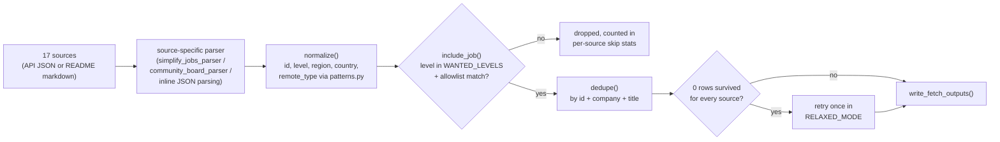
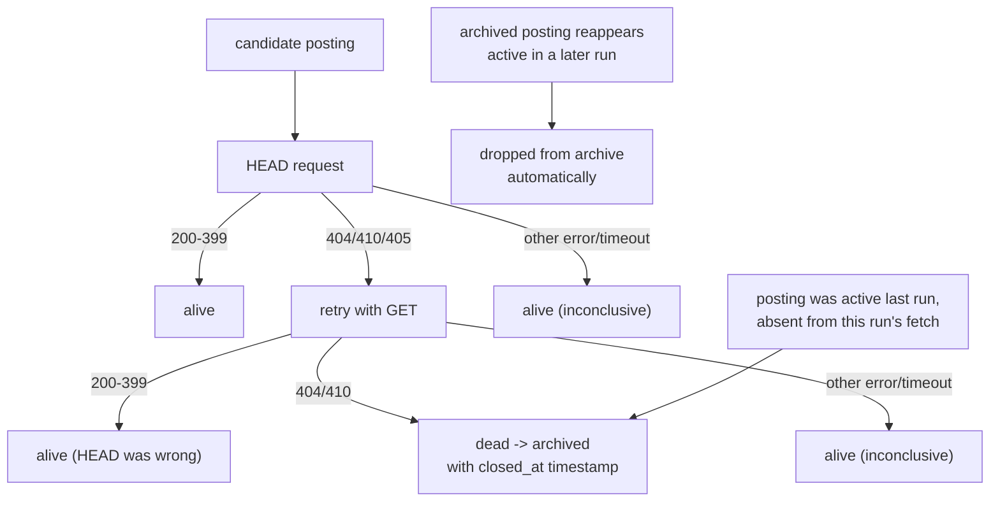
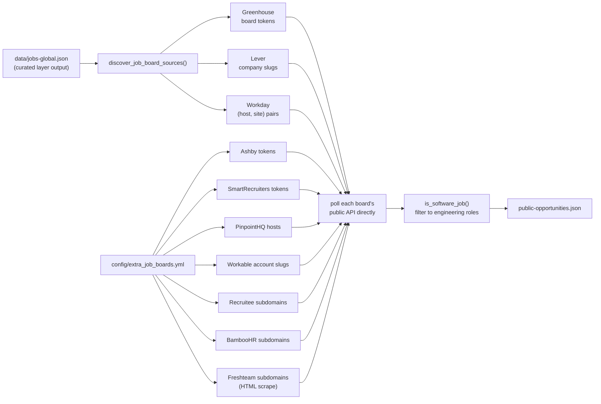
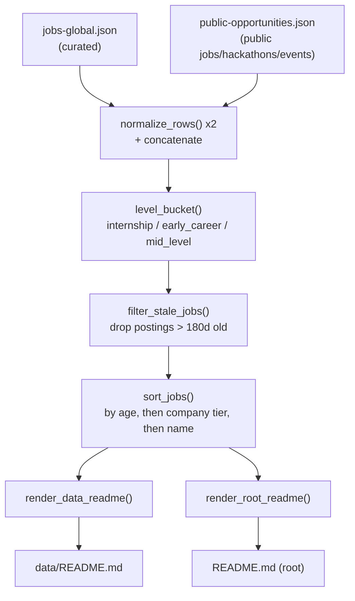

# Features

[← back to project overview](../README.md) · [docs index](../README.md#documentation)

## Curated job fetching

**Purpose:** Pull job postings from 18 hand-picked sources and keep only roles at top-tier companies, so the "Jobs" table stays high-signal instead of a firehose.

**Where it lives:** [scripts/fetch.py](../scripts/fetch.py) — one `fetch_<source>()` function per source (`fetch_remotive`, `fetch_arbeitnow`, `fetch_simplify_internships`, `fetch_simplify_newgrad`, `fetch_speedyapply_swe`/`_ai`, six `fetch_zapplyjobs_*`, `fetch_lorenzolacorte_eu`, `fetch_hanzili_canada`, `fetch_ambicuity_newgrad`, `fetch_amazon`, `fetch_netflix`, `fetch_apple`, `fetch_arbeitsagentur`), orchestrated by `main()`.

- **Amazon / Netflix / Apple** are the exceptions to "third-party tracker" — each hits the company's own careers API directly (Amazon `amazon.jobs`, Netflix's Eightfold instance, Apple `jobs.apple.com/api/v1/search`), free, keyless, verified live rather than assumed.
- **Apple** needs a one-call CSRF handshake (`GET /api/v1/csrfToken` → token + cookies, no auth). Its titles carry no level word, so `apple` sits in `UNKNOWN_LEVEL_SOURCES` next to `amazon` — an unlabelled "Software Engineer" passes the level filter; `SENIOR_TITLE_RE` still removes Senior/Staff/Principal/Lead.
- **Microsoft** (Eightfold data host serves an invalid TLS cert from CI) and **Meta** (`robots.txt` forbids automated collection) stay `aggregate_links.yml` rows instead — see [SOURCES.md](../SOURCES.md).

**How it works:** Each fetcher downloads its source (JSON API or a GitHub-hosted README), parses it into `(company, title, location, url, age)` tuples, runs each through `normalize()` to attach a stable id, detected level/region/country/remote-type, then `include_job()` filters by wanted level + `config/companies_allowlist.yml`. All source lists get concatenated and deduped by `dedupe()`. If zero rows survive strict filtering, `main()` retries everything once in `RELAXED_MODE` (level `unknown` allowed, non-allowlisted companies allowed for internship/new-grad only) so a single misbehaving regex can't zero out an entire run.

## Company allowlist filtering

**Purpose:** Guarantee the curated feed only contains roles at companies worth showing, regardless of how noisy a source's own listings are.

**Where it lives:** `config/companies_allowlist.yml` (data), loaded and checked in `scripts/fetch.py` via `ALLOWLIST`, `is_allowed_company()`.

**How it works:** The YAML file is parsed by hand (no PyYAML dependency) into a flat lowercase list, ignoring category headers and comments. `is_allowed_company(company)` matches an allowlist entry as a **whole token** — bounded by a non-alphanumeric character (or string start/end) on each side — so `"Amazon"` matches `"Amazon.com Services LLC"` and `"Amazon Web Services"` but not `"Metaphor"` (a plain `"meta" in c` used to wrongly accept it as Meta, dropping a random startup into the FAANG tier).

## Classification engine

**Purpose:** Turn a free-text job title and location string into structured fields (`level`, `region`, `country`, `remote_type`) that the rest of the pipeline can filter, bucket, and sort on.

**Where it lives:** [scripts/patterns.py](../scripts/patterns.py) — regex tables shared by both `fetch.py` (`FETCH_*`) and `public_sources.py` (`PUBLIC_*`); applied via `detect_level`, `detect_region`, `detect_remote_type`, `detect_country`, `detect_role_type`.

**`detect_country` + `country_flag` (G2):**
- `detect_country` was curated-only; now lives in `patterns.py` and `build_site_index` runs it over every *public*-layer job's location too, so the site's country filter isn't limited to the EU-skewed curated set. `FETCH_COUNTRY_MARK_MAP` covers ~55 countries across MENA / APAC / LATAM / wider Europe.
- `country_flag(name)` returns the flag emoji (Unicode regional-indicator pair from an ISO-2 map), or `""` for `Unknown` / `Remote` / anything unmapped; the site prefixes it in the location cell.
- Region tier renamed to a clean macro-region taxonomy on 2026-09-06 (`north_america` / `latam` / `europe` / `mena` / `apac` / `remote` / `unknown`) — see "Region detection" below.

**How it works:** each detector runs an ordered set of `re.compile(..., re.I)` patterns against the title or location string, returns the first match's category (e.g. `internship`, `new_grad`, `junior`), or a fallback (`"unknown"` curated / `"other"` public) if nothing matches.

**Region detection (`detect_region`):**
- Buckets a location into the continental macro-region tier: `north_america` / `latam` / `europe` / `mena` / `apac` / `remote` / `unknown`.
- Not `us`/`canada` (countries — the separate `country` field/filter) and not `emea` (nests Europe + MENA + Africa). South America is part of `latam` (no `south_america`); **`mena` (Middle East & Africa, incl. sub-Saharan) is checked before `europe`**.
- `WANTED_REGIONS` (curated layer) now keeps `latam`/`apac` roles from allowlisted companies that the old `us/canada/mena/emea` set silently dropped into `unknown`.
- Region enums in `config/job-entry.schema.json`, `config/public-entry.schema.json`, `config/site-index.schema.json` carry the seven values (older data may still carry pre-2026-09-06 `us`/`canada`/`emea`).

**On the site**, `geo.ts` `regionForItem()` resolves the bucket client-side in this order: the pipeline's own value (mapped through `REGION_ALIASES` for legacy data) → an explicit "remote" location → derived from the resolved country (`REGION_BY_COUNTRY`) → named in the location text → `unknown`. That's why `apac`/`latam` show up in the Region filter immediately, before the pipeline re-runs `detect_region` over the public layer.
- The Region `<MultiSelect>` is **data-driven** (`availableRegions` in `OpportunityBrowser`) — lists only buckets present in the loaded data, in `REGION_ORDER` (geographic buckets, then `remote`).
- `unknown` is a valid stored value but **never offered as a filter option** (not in `REGION_ORDER`/`REGION_VALUES`) — nobody filters for "roles in an unknown region".
- The **Country** filter is likewise data-driven (`availableCountries`), listing every country any loaded opportunity resolves to via `countryForItem()`.
- `filtersFromSearchParams` and `preferences.readPrefFilter` both remap `us`/`canada`/`emea` → the new values, so old shared URLs and saved preferences keep working.

**Role filter (2026-09-06):** `role_type` (`detect_role_type` — `software_engineer` / `full_stack` / `backend` / `frontend` / `mobile` / `platform` / `infrastructure` / `machine_learning` / `security` / `other_swe`) is its own multi-select facet in `FilterState.roles` (URL `?role=backend,frontend`), same data-driven pattern as Region (`availableRoles`, `ROLE_VALUES` order, hidden when empty). A soft signal in relevance scoring (`+2`), not a `contradictsPrefFilter` hard partition.

## Job-facet detection (tech tags, work authorisation, salary)

**Purpose:** Pull the signals a candidate actually filters on — the tech stack, visa sponsorship / no-degree, minimum years of experience, required spoken languages, and any disclosed pay range — straight from a posting's own description text, without ever guessing.

**Where it lives:** [scripts/patterns.py](../scripts/patterns.py) — `extract_job_facets()`:
- `detect_tech_tags` — ≈45-entry `TECH_TAG_PATTERNS`, first-match-wins (so "React Native" isn't also counted as "React").
- `detect_requirements` — visa / degree / relocation; `min_years_experience` (a number + "year(s)" only when an "experience" word follows close by, `\d{1,2}`-capped so "our 150-year history" can't match, lower bound of any range); `languages_required` (spoken languages next to a fluency/proficiency cue, from a fixed vocab excluding English and anything colliding with a programming-language name).
- `parse_salary` — a currency-marked two-ended range, sanity-checked.
- Wired in by `fetch.py`'s `normalize(..., description=)` for Remotive + ArbeitNow, and by `public_sources.py` for Greenhouse / Lever / Ashby; flows through `build_data_readme._site_index_entry` into `site-index.json`.
- Tests: [tests/test_patterns.py](../tests/test_patterns.py).

**How it works — strict-positive, never fabricated:**
- A facet key is added **only** when the text says so explicitly.
- `visa_sponsorship`/`degree_required`/`relocation` are `true`/`false` only on an explicit statement (a negative — "no visa sponsorship", "degree not required" — wins over a positive one); a silent posting gets **no key at all**, never a default `false`.
- `parse_salary` rejects anything that isn't a real range (single number, >10× spread, `min > max`, out-of-bounds for the detected period) rather than emit a shaky guess.
- The tech-tag regexes carry deliberate false-positive guards — bare "go" / "spark" / "spring" / "rust" as ordinary prose words must not tag a language — locked in by the tests.

**Where it surfaces:** the generated `data/README.md` prepends a 🛂 marker and appends an italic pay range to a job's title cell (see the "Markers" section it renders). On the site, `OpportunityTable`'s `FacetChips` renders the tech tags + a 🛂 Visa / No degree / pay-range chip row under each job, and `FilterBar` adds an "Any tech" dropdown (options = tags present in the loaded data, most-common first) plus **🛂 Visa sponsorship** and **No degree required** toggle chips — both explicit-only, matching `applyFilters`'s `=== true` / `=== false` checks.

## Résumé keyword-gap check (site, `/toolkit/resume`)

**Purpose:** Paste a job description and see which of the technologies it names are already on your profile and which are missing — the free version of the "ATS keyword" hint other job platforms charge for. A literal text diff: no upload, no LLM, no network (APPLICANT-TOOLKIT-PLAN.md Phase 5a / Lane R2).

**Where it lives:** [site/src/lib/keywordGap.ts](../site/src/lib/keywordGap.ts)
- `detectTechTags` / `detectRequirements` — a hand-kept TypeScript **mirror** of `detect_tech_tags` / `detect_requirements` in [scripts/patterns.py](../scripts/patterns.py) (same canonical tag names, first-match-wins order, requirement wording), so the site and the pipeline agree on what a JD "asks for".
- `analyzeKeywordGap(jd, profile)` diffs the JD's tags against the profile's `skills` (via `detectSkillTags`, a comma-joined variant so a lone "Go"/"Rust"/"Spark" chip still tags — the bare-word detectors are prose-strict) + `resumeText` (via `detectTechTags`), returning `{ jdTags, present, missing, missingInResume, extra, requirements, score, rubric }`.
- UI: `site/src/components/ResumeGapCheck.tsx` on `/toolkit/resume`.
- The same `detectSkillTags` also feeds `profileMatch.ts`, so a job's match score compares canonical tag ↔ canonical tag rather than raw skill strings.

**How it works:**
- `present` = JD tags found in your skills or résumé text; `missing` = JD tags in neither; `missingInResume` = the subset of `missing` that *is* in your résumé text (so the UI offers a one-tap "+ add" filing it into your structured skills via `bucketForTag`); `extra` = canonical tags you list that this JD never mentions.
- `score` = `present ÷ jdTags` as a shown percentage, `null` when the JD names no recognized tech; its `rubric` (skill coverage, résumé text length, contact block, quantified-bullet count) renders as a checklist, never a black-box number.
- `requirements` compares the JD's explicit degree / visa / relocation statements against `profile.eligibility` and flags a conflict (needs a degree you don't have; won't sponsor when you marked that you need it).

**Parity:** [tests/test_patterns.py](../tests/test_patterns.py) parses `TECH_TAG_PATTERNS` out of `keywordGap.ts` and asserts the tag list (names + order) is identical to the Python one, and that the three requirement keys are still checked — the same drift guard `formatSalaryShort` has. Change the tech-tag list on one side and this test fails until the other side matches.

## Cover letter builder (site, `/toolkit/cover-letter`)

**Purpose:** Turn your profile + one job description into a structured cover-letter *draft* — templated and editable, never a finished ghostwritten letter. Free, offline, no AI (APPLICANT-TOOLKIT-PLAN.md Phase 4a).

**Where it lives:** [site/src/lib/coverLetter.ts](../site/src/lib/coverLetter.ts)
- `buildCoverLetter(input, profile)` merges the role (company, title), the JD's tech tags also on your profile (`analyzeKeywordGap(jd, profile).present`), your latest experience entry + a bullet from it, your derived years-of-experience, and your own "why this company" text into `{ greeting, paragraphs, signoff, signature, placeholders }`; `coverLetterToText` / `coverLetterToMarkdown` serialize it.
- Four templates (concise / narrative / impact-led / referral) × three tones (warm / neutral / formal) × two lengths.
- The "impact" opener and the fit paragraph deliberately draw *different* bullets so the letter never repeats a line.

**One flow (`CoverLetterBuilder.tsx`, split-pane, live preview):**
- Generated from the résumé-derived profile + the pasted JD — no "manual vs automatic" switch.
- `recommendCoverLetterOptions(profile, jd)` auto-picks the template (impact if you have a quantified bullet, else narrative, else concise), a neutral tone, and length (full only when you have ≥2 roles *and* a long JD).
- All three controls **follow the recommendation until you change one** — an override then sticks (`tplOverride` / `toneOverride` / `lenOverride`, `null` = follow auto), with a **Reset to auto** link. A one-line note shows the auto pick + how many JD-named skills you're aligned on.
- `[bracketed]` prompts show a "N placeholders to fill" line.
- Export: **Copy text**, **Download PDF** (opens the browser print dialog → *Save as PDF*; `document.title` seeds the filename as `Cover letter — {company}`), **Save to application** (writes `TrackedApplication.coverLetterUsed`).

**No fabrication:** the engine only substitutes values the user typed (profile fields, the role, the "why" text). Anything it can't fill — a metric, a specific reason, a referrer's name — stays a visible `[bracket]`, counted in the "placeholders to fill" hint. Nothing is sent anywhere.

## Dead-link detection and archiving

**Purpose:** Keep the published list free of postings whose link is actually gone, without wrongly archiving/dropping live postings just because a server mishandled one HTTP verb.

**Where it lives:** `check_url_alive()` in [scripts/net.py](../scripts/net.py), shared by both collector layers. The curated layer's archiving logic is in `write_fetch_outputs()` in [scripts/fetch_outputs.py](../scripts/fetch_outputs.py) (archives to `jobs-global-archive.json` with `closed_at`); the public layer's is in `write_public_outputs()` in [scripts/public_outputs.py](../scripts/public_outputs.py) (drops the row outright — no archive file exists for that layer).

**How it works:** For each URL, `check_url_alive` tries `HEAD` first; a `HEAD` 404/410/405 is *not* trusted on its own (observed live on Pinterest's careers site) — it retries with `GET` before declaring the link dead. Anything else (403 bot-block, timeout, DNS error) is treated as "can't tell, assume alive." Separately, a posting present in the previous run but missing from this run's fresh fetch (rolled off the source, not necessarily dead-linked) is also archived. A posting that reappears active later has its stale archive entry dropped automatically.

**Soft-404 and bot-blocked exceptions (all hand-verified):** three sites can't be judged by status code alone, so `check_url_alive` special-cases them:
- **`_SOFT_404_RULES`** — a URL-regex → dead/alive-marker table. `google.com/about/careers/.../results/*` is dead when its `og:title` is empty; `jobs.apple.com/*/details/*` and `joinbytedance.com/search/*` are dead when a server-rendered `og:title` is *absent* entirely (a live posting always has one, an expired one falls back to a generic shell). Add a rule only after confirming the marker by hand against real live-vs-expired pages.
- **LinkedIn** — `linkedin.com/jobs/view/<id>` apply links (e.g. the whole `lorenzolacorte_eu` feed) are bot-blocked on the page itself, so `check_url_alive` fetches LinkedIn's unauthenticated guest fragment instead. It treats "No longer accepting applications" / a 404 as dead — and, unlike every other case, an *inconclusive* read (bot-block, empty fragment, timeout) after 3 retries also resolves to **dead**, not alive. LinkedIn scraped links are the lowest-trust input and go stale within days; a curated-layer archive is reversible, so the row returns automatically once LinkedIn answers again.

**Persistent liveness cache → the "Verified open" signal (A1):**

- `resolve_link_liveness()` (`net.py`) records every URL it confirms alive, with a timestamp, into `data/link-cache.json` (`{url: {alive: true, at}}`, positive results only, 12h TTL, 7-day prune) — mainly a wall-clock optimization, skipping re-checks on ~3,000 URLs that were fine an hour ago.
- `build_site_index()` reads it too: each `site-index.json` item gets `liveness` (`verified` if its raw URL is cached alive, `unverified` otherwise) and, when verified, `last_checked`.
- `unverified` is **not** "dead" — a confirmed-dead link is already archived/dropped before this file is written. It just means "not in the cache" (new, inconclusive, or aged out).
- The site's `OpportunityTable` renders a positive-only **"Verified open · checked 34 min ago"** badge for `liveness === "verified"` jobs, nothing for the rest — mirroring the community boards' ✅ column, where absence is silence, not a red flag.

## Schema validation on write

**Purpose:** Guarantee every row this pipeline publishes actually matches the JSON Schema it claims to (`config/job-entry.schema.json` / `config/public-entry.schema.json`), so a coding bug or an unexpected upstream value fails the run loudly instead of silently shipping malformed data to whatever reads these files next (the planned site, most directly).

**Where it lives:** [scripts/schema_validator.py](../scripts/schema_validator.py) (the validator itself — dependency-free, no `jsonschema` package, matching this repo's stdlib-only rule), called from `write_fetch_outputs()` in `fetch_outputs.py` and `write_public_outputs()` in `public_outputs.py`.

**How it works:**

- A small draft-07 subset — `type`, `enum`, `pattern`, `format: uri`, `required`, `additionalProperties: false` — covers everything the two schema files use, without a general JSON Schema implementation.
- Both write functions validate every row immediately before writing.
- Any error raises `ValueError` (up to 20 specific messages logged first), which — combined with the hourly workflow's `set -euo pipefail` — aborts the run entirely instead of opening a PR with bad data.
- No workflow YAML change was needed: validation lives inside the same `fetch.py`/`public_sources.py` runs the hourly workflow already calls.

## Change-only output writes

**Purpose:** Avoid noisy commits/PRs — the hourly workflow should only open a PR when the published data actually changed.

**Where it lives:** `write_fetch_outputs()` in [scripts/fetch_outputs.py](../scripts/fetch_outputs.py).

**How it works:** Each new row is compared against the previous run's row with the same `id` via a content signature (`_job_signature`, JSON of the meaningful fields, sorted keys) that deliberately excludes noisy fields like `age`/`collected_at`. If every row's signature and the active-file ordering are unchanged, the function logs "No job changes detected" and returns without touching any file on disk — so an hour with zero real changes produces zero git diff.

## Public / auto-discovery layer

**Purpose:** Widen coverage far beyond the curated allowlist by polling the actual ATS (applicant tracking system) APIs behind companies already seen in the curated feed — no manual company list needed for the three biggest ATS platforms.

**Where it lives:** [scripts/public_sources.py](../scripts/public_sources.py) — `discover_job_board_sources()`, `fetch_greenhouse_board_jobs`, `fetch_lever_jobs`, `fetch_workday_jobs`, `fetch_ashby_board_jobs`, `fetch_smartrecruiters_jobs`, `fetch_pinpoint_jobs`, `fetch_workable_jobs`, `fetch_recruitee_jobs`, `fetch_bamboohr_jobs`, `fetch_freshteam_jobs`.

**How it works:** `discover_job_board_sources()` scans every URL already in `data/jobs-global.json` (the curated layer's output) for a Greenhouse board token, Lever company slug, or Workday `(host, site)` pair, using dedicated URL-shape extractors. Any company found this way gets its full board polled directly on the *next* run — no config file entry required. Ashby, SmartRecruiters, PinpointHQ, Workable, Recruitee, BambooHR, and Freshteam can't be auto-discovered this way (no reliable URL signature), so their companies are curated by hand in `config/extra_job_boards.yml`.

**PinpointHQ (`fetch_pinpoint_jobs`):**
- `config/extra_job_boards.yml`'s `pinpoint:` section: a bare token → `<token>.pinpointhq.com`, or a full custom careers host (any token with a dot, e.g. `careers.moneyfellows.com`).
- Each host's `/postings.json` returns a bare list. `_pinpoint_location()` probes the many field names PinpointHQ tenants use for location (`location_name`, nested `job.location`, `structure_custom_group_*` where the group title is location/office/city/country, `locations[]`); `_pinpoint_company_from_host()` derives the display name from the host.
- `region` is computed from the resolved location *before* any `(Remote)` suffix, so a Dubai role stays `mena` rather than collapsing to `remote`.
- Description = `description` + `key_responsibilities` + `skills_knowledge_expertise` (HTML-unescaped), feeding the B3/B4/B5 facet detectors.
- Seeded: **Tabby** (Dubai/Riyadh), **Money Fellows** (Cairo).

**Workable (`fetch_workable_jobs`):**
- `config/extra_job_boards.yml`'s `workable:` section: the `apply.workable.com/<slug>` account slug.
- One keyless GET on `apply.workable.com/api/v1/widget/accounts/<slug>?details=true` returns `{name, jobs:[…]}` with every posting's full HTML JD inline — no pagination for typical board sizes.
- `_workable_locations()` reads `locations[]` (authoritative for multi-site postings) or falls back to flat `city`/`country`; 2+ distinct locations render as a `
` dropdown via `format_location_display()` (same as Workday).
- `region` resolved from the location(s) *before* the `(Remote)` suffix (driven by the `telecommuting` flag), so a Cairo-based remote role stays `mena`.
- HTML `description` feeds the B3/B4/B5 facet detectors.
- Seeded: **Foodics** (Riyadh), **Lucidya** (Riyadh), **Salla** (Jeddah); 2026-09-10 added **robusta** (Cairo), **b_labs**.

**Recruitee (`fetch_recruitee_jobs`):**
- `config/extra_job_boards.yml`'s `recruitee:` section: the `<slug>.recruitee.com` subdomain.
- One keyless GET on `<slug>.recruitee.com/api/offers/` returns `{offers:[…]}`; only `status == "published"` rows kept.
- `_recruitee_locations()` reads `locations[]` (or flat `city`/`country`); region resolved before any `(Remote)` suffix (driven by the `remote` flag).
- `description` + `requirements` (HTML-unescaped) feed the facet detectors.
- Added 2026-09-10 for **sahl** (Cairo insurtech). `recruitee` is now in `PIPELINE_SUPPORTED`; the verifier's `check_recruitee` predates this.

**BambooHR (`fetch_bamboohr_jobs`):**
- `config/extra_job_boards.yml`'s `bamboohr:` section: the `<token>.bamboohr.com` subdomain — not necessarily the company's current brand (e.g. Instabug rebranded to Luciq, but the board is still `instabug.bamboohr.com`).
- Unlike every other ATS here, the list endpoint (`/careers/list` → `{"result": […]}`) gives only bare `{id, jobOpeningName, location}` — no description, precise location, or date — so `fetch_bamboohr_job_detail()` makes a **second GET per posting** at `/careers/<id>/detail` to fill all three in.
- Every row needs this call (unlike Workday's "only multi-location postings" case); a BambooHR board is typically a handful of postings, so the extra request per job is cheap.
- Region resolved before any `(Remote)` suffix, same rule as the other ATSes.
- Confirmed live 2026-09-15 against `instabug.bamboohr.com`, but its one opening isn't a software role — no company seeded yet.

**Freshteam (`fetch_freshteam_jobs`):**
- `config/extra_job_boards.yml`'s `freshteam:` section: the `<slug>.freshteam.com` subdomain.
- **No JSON API exists** — confirmed 2026-09-15 by inspecting its `job_filter` JS bundle, which only shows/hides already-rendered DOM by `data-portal-*` attributes and never calls out to anything. The careers page is fully server-rendered.
- `fetch_freshteam_jobs` is a regex-based HTML scrape (same category as `community_board_parser.py`, not a shortcut around an API that exists): each posting is one `<a class="heading" href="/jobs/<id>/<slug>" data-portal-location="…" data-portal-remote-location=true|false>` anchor wrapping a `.job-title` div and a short `.job-desc text` excerpt.
- No per-job detail page (unlike BambooHR) — facet detection works with less text and reports correspondingly less, never fabricating the rest.
- Seeded: **Locus.sh**, **Sequoia Applied Technologies** — found via web search, not a MENA guess (no MENA company confirmed on Freshteam yet).

*Note (2026-09-10):* the `software_engineer` role-type pattern in `patterns.py` was widened — "Software Development Engineer", "Software Dev Engineer", "SDE", "SWE", "Application Software Engineer" now classify as `software_engineer` instead of falling through to `other_swe`, which `is_software_job()` doesn't accept. Those titles were being silently dropped by every public-layer board (Greenhouse/Lever/Ashby/Workable/Recruitee/…).

## Workday multi-location resolution

**Purpose:** Workday's job *listing* API only ever returns a bare count ("2 Locations") for multi-location postings, never the actual city names — this feature resolves that into a real, readable dropdown.

**Where it lives:** `fetch_workday_job_locations()` and the `WORKDAY_LOCATION_COUNT_RE` check inside `fetch_workday_jobs()` in [scripts/public_sources.py](../scripts/public_sources.py).

**How it works:** `fetch_workday_jobs` detects the bare-count shape (`^\d+\s+locations?$`) and, only for postings that need it (capped at `max_location_lookups=25` per board to bound API calls), makes one extra per-job detail call to the Workday CXS API to pull `jobPostingInfo.location` + `additionalLocations`. The result is rendered the same way the curated layer already renders SimplifyJobs multi-location postings — a `

` dropdown — via the shared `format_location_display()` helper.

## Hackathon and event discovery

**Purpose:** Broaden the tracker beyond jobs to include build events (hackathons, tech meetups) that the same audience — students and early-career engineers — cares about, from more than one hackathon catalog so no single site's blind spots become the tracker's blind spots.

**Where it lives:** `fetch_devpost_hackathons()`, `fetch_unstop_hackathons()`, `fetch_devfolio_hackathons()`, `fetch_hackerearth_hackathons()`, and `fetch_luma_discover()` / `parse_luma_discover()` in [scripts/public_sources.py](../scripts/public_sources.py).

**How it works:**

- **Devpost** — the hackathons *page* is client-rendered with no listings in the server HTML, so this hits `devpost.com/api/hackathons` directly (the JSON API the site's own frontend calls), paginated until `total_count` is reached.
- **Unstop** (`oppstatus=recruiting`) and **Devfolio** (filtered client-side to events whose `ends_at` hasn't passed) — two more real, free, keyless catalogs. Unstop skews global with strong India coverage; Devfolio skews Web3/student hackathons — neither covered as deeply by Devpost.
- **HackerEarth**'s `/chrome-extension/events/` endpoint (the keyless JSON its browser extension calls, not `robots.txt`-disallowed) adds a small but high-signal featured set, notably stronger on MENA/India events and hiring challenges; rows whose `end_utc_tz` is already past are dropped.
- **Luma**'s `/discover` page is a general community directory (book clubs, walking tours, design meetups — not just tech), so `LUMA_RELEVANT_RE` filters the scraped anchor text to entries whose visible text signals software/AI/startup relevance before including them.

**Curated events (`config/events.yml` → `fetch_curated_events`):**

- Conferences, summits, and career fairs (Techne Summit, RiseUp, GITEX, LEAP, Web Summit, …) have no pollable API — Luma's scrape is the only live event source, and it's thin.
- Kept in a hand-maintained line file (`Name | Organizer | City, Country | YYYY-MM-DD | URL`), rendered with a live countdown.
- **Auto-hidden once the date passes** — an annual event just needs its date bumped when the next edition is announced.
- Same "verify before adding" discipline as `aggregate_links.yml`.

## README/data rendering

**Purpose:** Turn the two machine-oriented JSON files into the two human-oriented Markdown pages people actually browse.

**Where it lives:** [scripts/build_data_readme.py](../scripts/build_data_readme.py) — `render_root_readme()`, `render_data_readme()`, plus helpers `level_bucket`, `filter_stale_jobs`, `format_age`, `table_rows`, `badge`.

**How it works:**

- Loads `jobs-global.json` + `public-opportunities.json`, normalizes both into one shared row shape (tagging origin as `curated` or `public`).
- Buckets every job into `internship` / `early_career` / `mid_level` via `level_bucket()`; drops anything older than 180 days via `filter_stale_jobs()`.
- Renders two Markdown files: a lean root `README.md` (badges + snapshot counts + links) and the full `data/README.md` (every job table, hackathons, events, a **Browse Every Role** section, the source-file index). Both carry a "generated — don't hand-edit" notice.
- Titles/locations a source hands over in all-lowercase (e.g. LorenzoLaCorte's LinkedIn scrape) are title-cased by `smart_title_case()` (`scripts/company_names.py`) — acronyms and already-cased strings left alone.

**Job ordering (`sort_jobs`):**
- Company tier first (FAANG → big-tech → cloud → … from the allowlist section order, `CATEGORY_RANK`, mirrored in `scripts/fetch.py`); uncategorized public-layer rows sort last.
- *Within* a tier, every one of a company's roles stays together as one block; blocks ordered by the company's freshest posting, each block sorted newest-first — so a table reads "Google (6 roles), then Netflix (3), then Apple (1)…" instead of interleaving by age.
- The site's default "Top companies" sort (`OpportunityBrowser.tsx`) mirrors this exactly.

**Company-name normalization (`company_names.prettify_company_name`):**
- Re-cases machine tokens (`openai` → `OpenAI`).
- Collapses a legal-entity/regional-subsidiary name to the parent brand — `Amazon.com Services LLC` / `Amazon Kuiper Commercial Services LLC` / `Amazon Development Centre Canada ULC` → `Amazon`, `Uber Technologies, Inc.` → `Uber` — only when *every* token after a known parent brand is corporate/legal/geographic filler, so a real sub-brand (`Amazon Robotics`, `Amazon Web Services`, `Google Fiber`) stays intact.

**Age reconciliation (`reconcile_age`):**
- The curated feed freezes a row's `age` between runs (avoids hourly churn); some community-README parsers seed `"0d"` when they can't read the source's date cell. Both can leave weeks-old listings showing as brand new.
- `posted_at` is frozen at first-seen, so days-since-`posted_at` is a hard lower bound: `reconcile_age` trusts a parseable source age only while it's within that bound, otherwise shows the bound.
- Applied to every job row in `data/README.md` and `site-index.json`; hackathon/event `age` (a deadline countdown) is left untouched.

**Multi-location postings:**
- The curated layer bakes a `

` dropdown into `location` for the Markdown tables (`format_location_display`).
- `site-index.json` feeds a real UI, not a Markdown renderer, so `_clean_site_location()` unpacks that HTML back into a plain `"First, Place +N more"` summary plus a `locations[]` array; the site's `OpportunityTable` renders its own `
` control from the array.

**Trend history (`update_stats_history` + `summarize_snapshot_dimensions`):**
- Same run appends one `StatsHistorySnapshot` to `data/stats-history.json` (90-day cap) — the totals the README already computes, plus a `dimensions` object: level / region / remote-type / role-type / category (exhaustive, blank → `unknown`) and country / source / company (top ~15–20).
- A *forward-built* time series — one point per hourly run — so a site gets a real trend line from a plain fetch instead of scraping this repo's git history through GitHub's rate-limited API.
- `dimensions` is optional in the schema, so snapshots written before it existed still validate.

**Story cards (`build_story_cards`):**
- Derives `data/story-cards.json` — 3–4 `{id, title, detail, filter}` "state of hiring" cards from that history: total roles + week-over-week delta, internships + month-over-month %, top-posting companies, top regions.
- Picks the *nearest dimensioned snapshot strictly older than* the latest for each comparison — a sparse history (only the newest run has `dimensions`) simply omits the "since last week"/"this month" clauses rather than inventing them.
- All copy lives in the generator, per the repo rule.
- The site's `<StoryStrip>` renders these on the **Dashboard** (`DashboardStory.tsx`; moved off the main list 2026-09-10 — roles come first there); each card links to the jobs page with its `filter` serialized into the URL. Missing `story-cards.json` (older deploy) → nothing renders.

## Dead-simple config extension points

**Purpose:** Let non-Python contributors change which companies/boards are tracked without touching code.

**Where it lives:** `config/companies_allowlist.yml`, `config/extra_job_boards.yml`, `config/aggregate_links.yml`.

**How it works:**

- All three are plain lists read line-by-line — no YAML parser library dependency.
- Adding a company to the curated allowlist, or an Ashby/SmartRecruiters/PinpointHQ/Workable board token to `extra_job_boards.yml`, takes effect on the very next hourly run — see [CONTRIBUTING.md](../CONTRIBUTING.md) for steps and the SmartRecruiters caveat (its API returns HTTP 200 for *any* slug, valid or not, so an unverified addition silently does nothing).
- `config/aggregate_links.yml` (`Company | link text | URL` per line) is for companies with no enumerable public board (Google, Meta, Microsoft, Apple, plus MENA majors like Talabat / Noon / Careem) — each becomes one hand-verified "browse all early-career roles" row.
- `load_aggregate_links()` renders it into `data/README.md`'s **Browse Every Role** section, and passes it to `build_site_index()`, which appends it to `site-index.json` as a `kind:"board"` / `origin:"config"` item (no `liveness`, empty `age`/`posted_at`/`location`).
- On the site, `kind:"board"` items are filtered out of `OpportunityBrowser` entirely — `data/README.md`'s "Browse Every Role" section is their only rendered home. *(An on-list `<BrowseEveryRole>` chip strip, then a footer "Browse directly" list, both existed briefly and were removed 2026-09-10 as page noise.)*

## Website

**Purpose:** A fast, no-account frontend over `data/site-index.json` — the same data the READMEs render, but browsable, filterable, and personalised.

**Where it lives:** `site/` (Astro + React islands, deployed separately, reads `site-index.json` / `stats-history.json` from jsDelivr at runtime so it's ≤1h stale without redeploying).

**How it works — two control surfaces, one job each (Lane H):**

1. **`FilterBar`** — the *only* place facets live:
   - Kind tabs · search · **multi-select** Level / Region / Work-type / Country / **Company** / Tech (a reusable `MultiSelect` popover; Country, Company, Tech are searchable, capped at 200 rendered with a "keep typing" hint) · an explicit-only 🛂 Visa toggle.
   - Every array facet serializes to a comma-joined URL param (`?companies=Amazon,Stripe`) — a filtered view is a shareable link.
   - A **"★ Save as my preferences"** button (next to *Clear filters*) stores the current filter as your preference.
   - *(The "No degree required" filter was removed as low-value; the `degree_required` signal still shows as a chip.)*
2. **Sort** — three modes:
   - **Top companies** (`companyTier()`, FAANG-first) — the neutral default.
   - **Newest** — by age.
   - **Best match** — scores against your **profile** when filled (`scoreJobForProfile()`, `lib/profileMatch.ts`: skills ↔ `tech_tags`, targets, salary floor, visa, degree, derived years-of-experience vs `min_years_experience`, required languages), falling back to your saved filter (`scoreOpportunity()`, `lib/preferences.ts` + a "Tune ranking" popover for keyword boost / hidden companies) when there's no profile.
   - *(The separate "Relevance" mode was folded into "Best match" 2026-09-10 — two overlapping personalized ranks was one too many; a stored `"relevance"` remaps to `"match"` on read.)*
   - Best match ranks **jobs only** — hackathons/events carry no profile signal, keep their natural order below the scored jobs, get no match pill.
   - Profile mode: each job row gets a compact `🎯 N% match` pill + **one** headline reason (`OpportunityTable`'s `MatchChips`; the full +reason/−gap breakdown is in the pill's tooltip, not sprayed across the row). Filter mode: terse "why it matched" chips. Both partition **flat contradictions** below a *"N less-relevant roles — show anyway"* toggle.
   - Best-match mode suppresses the row's tech-tag chips (the match line already names the stack overlap); the standalone "No degree" chip was removed as low-value (the signal still feeds the score).
   - The profile-mode score freezes onto `TrackedApplication.matchScore` when you Track a role; `PersonalDashboard` (`/applications`) shows the distribution of those frozen scores (Strong ≥70 / Fair / Weak).

   **The profile-mode score (`scoreJobForProfile`, reworked 2026-09-10):**
   - The badge is **earned ÷ assessable** — the share of checkable signals that came out in your favor — pulled toward a neutral 50 by a confidence factor (`min(1, assessable_points / 9)`), so a posting where only the title told us anything reads ~50%, not a false 0% or 100%. Replaced a fixed `SCORE_CEIL = 20` divisor that made every region/level match land on the same low number.
   - The skills ↔ `tech_tags` term is **proportional** (`weight × coverage`, with a small absolute-overlap nudge) — knowing 12/15 of a stack beats knowing 6/15, where the old flat `min(hit, 5)` cap scored both the same.
   - `detect_tech_tags` is sparse (~40% of tagged postings surface ≤3 tags; many intern JDs yield one or none), so the term **only engages once the JD gave ≥3 tags** (else "1/1 of the stack" would read as a perfect fit), and its weight scales with tag count (`evidence = min(1, tags/8)`), not just hit rate. A posting with too few tags gets no stack signal (shown as such), not an inflated one — no title-word fallback.
   - A small always-on **recency** term (`≤1d` → full, tapering to `≤14d`) breaks ties so two otherwise-identical postings still get a stable order.
   - With the profile's **Targets** section empty there's little else to weigh, so a broad generalist can legitimately see a tight band across similar roles; filling target level/role/region spreads it out.
   - **Seniority is read from the title, not `item.level`** — the pipeline collapses "Staff / Principal / Lead / Director" down to `mid_level`, so `profileMatch.ts` mirrors `SENIOR_TITLE_RE` and compares the title's tier (early/mid/senior) to yours (from your target levels, else derived years of experience — unknown history reads as *early*). A senior/staff title when you're early-career is a **hard contradiction** (capped at 12%, dropped below "show anyway"); an unmarked "Software Engineer" title isn't held against you. `contradictsPrefFilter` no longer banishes a posting just for having *no* detected level.
   - **Default:** a returning visitor with a filled profile lands on *Best match*; failing that, *Best match* (filter mode) if a saved filter exists; otherwise *Top companies* — always a *smart default*, never persisted, so an explicit click wins.

There is no separate preferences panel — level/region/work-type live in exactly one place. `OpportunityBrowser.tsx` is the main island wiring these together, plus:

- **`SnapshotHero`** — one compact line: total open-opportunity count, a `FreshnessPulse` + "updated Nh ago" + "N added today", a "charts & trends →" link to the dashboard. Per-slice stat chips (internships / new-grad / remote / hackathons) **removed 2026-09-10** — duplicated the FilterBar's facet counts (G8) and the dashboard; the headline number is the one thing not repeated elsewhere.
- **`<StoryStrip>`** — on the **Dashboard** ("This week's hiring trends"): `data/story-cards.json` cards, each linking to the jobs page with its `filter` in the URL. `build_story_cards()` emits only level-*trend* cards ("Internships up 12% this month", count-free, only when a month-old snapshot exists to compare), a top-3-companies card, a top-2-regions card — trends and rankings, no raw counts.
- **"New since your last visit"** (`lib/visitHistory.ts`) — diffs the current id set against ids seen last visit; a banner with a "show only new" toggle. Baseline re-writes every load, so a same-session reload shows zero new. Opportunity-only (`kind:"board"` excluded). *(The old per-row "Not interested" control was removed as clutter; `lib/dismissed.ts` stays unused for a future "for you" gesture.)*
- **`SavedSearches`** (`lib/savedSearches.ts`) — named filter combos for quick recall, distinct from the single saved-preferences filter.
- **`OpportunityTable`** — per-kind columns:
  - `LivenessBadge` — "Verified open · checked Xm ago", positive-only.
  - `FacetChips` — tech tags + 🛂 Visa / No-degree / pay-range under each job.
  - Country flag image in the location cell (`<Flag>` → flagcdn.com PNGs — flag *emoji* render as bare letters on Windows). Resolved via `lib/geo.ts` `countryForItem`, falling back to detecting from the location string so it works before the pipeline sets `country` on public rows.
  - `formatAge` bucketed like the README.
  - `CompanyAvatar` — real favicon only for a hand-verified domain, else initials — never a guessed logo.
- **Header** (`Layout.astro`) — minimal masthead: **Tracker** wordmark + nav + theme toggle, one row. The descriptive tagline now lives only in the footer (used to be in both).
- **Footer** (`Layout.astro`, every page) — center-aligned, `max-w-xl`: the one-line description, an "Alerts (RSS): …" row (five feeds), a "Source & docs ↗ · ♥ Sponsor ↗" row (→ github.com/sponsors/AhmedNassar7). Replaces the standalone `RssFeedLinks` box; a "Browse directly" company list that briefly lived here was removed as noise.
- **`<ClientRouter />`** — native cross-page view transitions.
- **Pagination** (`Pagination.tsx`, `PAGE_SIZE` 30) — first/last + current±1 bar, "Showing 31–60 of 3,318" readout; any filter/sort change resets to page 1 and scrolls up.

- **Activity streak & heatmap** (`lib/activity.ts`, `ActivityHeatmap.tsx`, on `PersonalDashboard`):
  - A localStorage day-stamp log (capped 420 days), recorded once per page-mount from `HeaderStat` (any page visited counts) and again on a real application status change from `tracker.ts`.
  - Renders a 🔥 current-streak badge (plus best-ever) and a 26-week GitHub-style calendar grid — plain HTML cells, native `title` tooltips, no charting library, colored with `ACTIVITY_RAMP` (the same validated teal ramp `FUNNEL_RAMP` uses elsewhere on the site).
  - Shows even with zero tracked applications — a visit alone counts.
- **Region RSS feeds** (Lane C3/F2, `scripts/rss_feeds.py`):
  - 6 more preset feeds beyond the original 5 (`region-mena.xml`, `region-europe.xml`, `region-apac.xml`, `region-latam.xml`, `region-north_america.xml`, `region-remote.xml`), filtering on the `region` field set at site-index build time.
  - A bounded, hand-picked set — not the true "arbitrary saved-search feed" C3 originally described, since a static site can't compute custom filtered XML on demand without a server this project doesn't have.
  - Listed in `data/README.md`'s RSS table (generated from `FEED_PRESETS`, not hand-duplicated); **not** added to the footer's "Alerts (RSS)" row, which stays at its original 5 to avoid link-list clutter.
- **Per-search webhook push** (Lane C4, `savedSearches.ts` `webhookUrl` field, the 🔗 button on each saved-search pill):
  - Paste your own Discord/Slack/Telegram URL (stored only in this browser); `pushWebhookMatches` (`lib/notifications.ts`, run from `OpportunityBrowser` on fresh data, rate-limited to ~once per 6h) POSTs new matches for that search to it.
  - Uses `mode: "no-cors"` deliberately — a JSON POST with `Content-Type: application/json` triggers a CORS preflight most incoming-webhook endpoints (Slack's, notably) never answer, silently dropping the request; a `no-cors` "simple request" (no preflight) actually gets delivered, at the cost of never confirming delivery server-side.
  - Telegram has no generic webhook concept, so a pasted `sendMessage` URL gets the text appended as a query param.
  - Delivery is always best-effort and unconfirmed — the UI says so.
  - *(A separate "🔔 Turn on alerts" browser-notification toggle — Lane C7 — was built alongside this and then **removed**: users didn't know what it meant, what it did, or when it would fire, and it duplicated what the webhook already does more concretely — a URL you control, tied to one named search, no ambiguous permission prompt. `checkAndNotify` was replaced by the narrower `pushWebhookMatches`.)*

**Navigation (`Layout.astro`):**
- Three top-level entries — **Jobs** (`/`), **Dashboard** (`/dashboard`), **My Workspace** (`/profile`).
- **`/dashboard`** = the *global* picture (region/level/source mix over everything published — `GlobalDashboard` — plus "this week's hiring trends" — `DashboardStory`).
- **My Workspace** = *your* stuff, three local-only tools sharing a sub-tab bar (`WorkspaceNav.astro`): **Profile** (`/profile`), **Applications** (`/applications` — the tracked-application board plus, below it, `PersonalDashboard`: your funnel, stage timings, frozen-match-score quality — moved here from the dashboard 2026-09-10 so all your-data lives in one place), **Résumé check** (`/toolkit/resume`), **Cover letter** (`/toolkit/cover-letter`). Each keeps its own URL (shareable, bookmarkable); the sub-nav just presents them as one area.
- Nav + sub-tab links carry `data-astro-prefetch="viewport"` (config `prefetch: { prefetchAll: false }`) — switching between the three personal pages fetches the next document before you click; only island hydration remains a perceptible cost.
- *(Standalone `/mena`, `/resources`, and `/today` pages were each built and then removed 2026-09-10 — `/mena` duplicated the Region filter, `/resources` was static link lists beside a live feed, `/today`'s "new since last visit" was near-always empty on the visit that opened it (the Jobs page advances last-visit) while its "top picks"/"pipeline" just restated the Best-match sort and the dashboard. `data/resources.md` stays as the hand-curated doc, linked from the README.)*

## Design system & motion

**Purpose:** One small, consistent set of color and motion tokens across the site, applied sparingly — not a per-component grab-bag of transitions.

**Where it lives:** [site/src/styles/global.css](../site/src/styles/global.css) — plain CSS `@keyframes`/`transition`, guarded by `prefers-reduced-motion`. No motion library (Framer Motion, GSAP) anywhere in `site/`.

**Brand color:** one teal, light/dark — `#0f766e` (light) / `#2dd4bf` (dark, under `:root.dark`) — used on the hero's rotating-word tagline (`.tagline-word`, `SnapshotHero.tsx`) and echoed in the `FUNNEL_RAMP`/`ACTIVITY_RAMP` teal scales the funnel chart and the activity heatmap (above) already use.

**Every real animation — name, duration/easing, and what triggers it:**

| Keyframe | Duration / easing | Fires on | Values |
|---|---|---|---|
| `pop` | 0.3s ease-out | Bookmark toggle (`BookmarkButton.tsx`) | scale 1 → 1.35 → 1 |
| `row-enter` | 0.25s ease-out, `both`, per-row `animationDelay` for a stagger | A genuinely *new* row entering a filtered table (`OpportunityTable.tsx`) — React keeps the same DOM node for a row it's already rendered, so an existing row updating in place never replays this | opacity 0→1, translateY 4px→0 |
| `hero-enter` | 0.4s ease-out | First paint of the snapshot hero (`SnapshotHero.tsx`) | opacity 0→1, translateY 8px→0 |
| `tagline-cycle` | 16s ease-in-out, infinite, 4 words offset 0/4/8/12s | The rotating noun in the hero tagline (roles → internships → hackathons → events) | opacity 0→1→0, translateY ±90%→0 |
| `story-card-enter` | 0.45s cubic-bezier(0.22, 1, 0.36, 1) | Story-strip cards settling in on the dashboard (`StoryStrip.tsx`) | opacity 0→1, translateY 10px→0, scale 0.985→1 |
| `tour-backdrop-enter` / `tour-callout-content-enter` / `tour-icon-pop` | 0.15s / 0.2s / 0.35s ease-out (icon pop uses cubic-bezier(0.22, 1, 0.36, 1) for its overshoot) | Each step of the first-visit spotlight tour (`TourModal.tsx`) | fade / fade+translateY(4px) / scale 0.7→1.08→1 |

The tour's spotlight box and callout **position** themselves with a plain `transition` (`top`/`left`/`width`/`height`, 0.3s cubic-bezier(0.22, 1, 0.36, 1) each), not `@keyframes` — they're driven every frame from a live `getBoundingClientRect()`, so animating a *transition* between two states is the right tool where a fixed keyframe wouldn't track a moving target.

**Not CSS-animated:** the company-logo marquee (`CompanyShowcase.tsx`) drives its scroll/drag from a `requestAnimationFrame` loop that sets `transform` directly — a CSS keyframe animation can't blend live with a pointer-drag offset without a visible jump back to the keyframe's own position. CSS there only handles the edge fade mask and the reduced-motion fallback (static wrapped grid, duplicate copy hidden).

**Reduced motion:** every entrance/pop keyframe is scoped inside `@media (prefers-reduced-motion: no-preference)` — none of them play for a user who has asked for less motion. The tagline shows only its first word, static; the tour's position `transition` is explicitly set to `none`; the logo marquee's JS auto-scroll/drag never starts.
