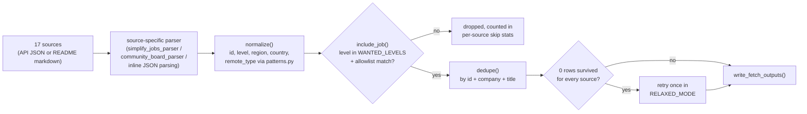
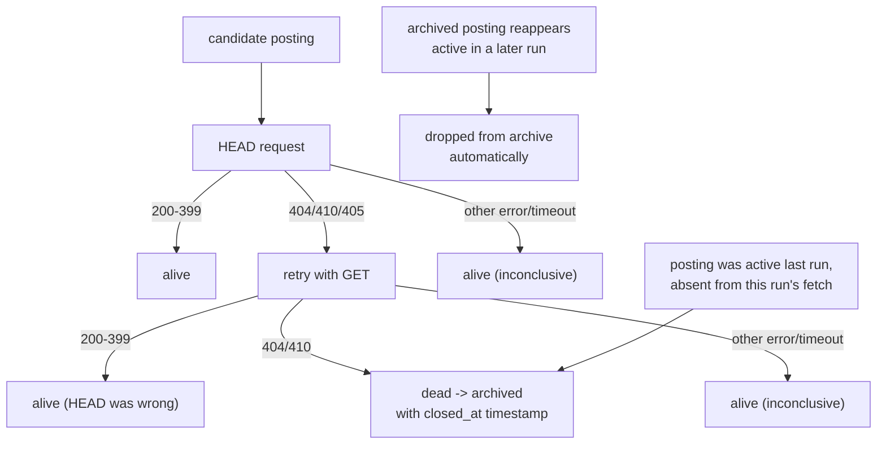
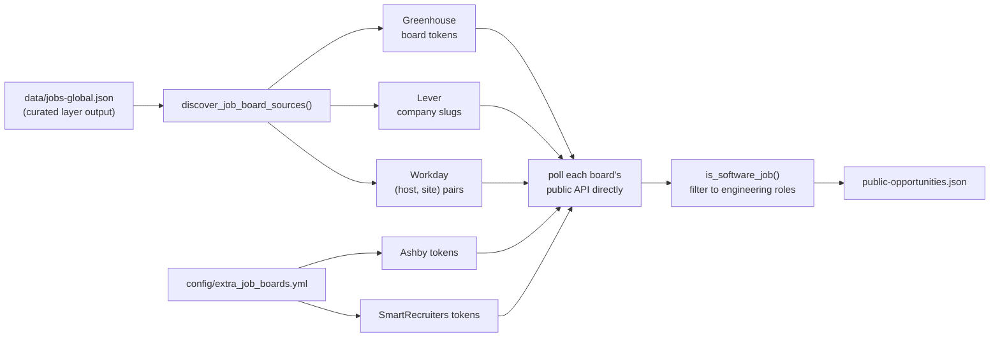

# Features

[← back to project overview](../README.md) · [docs index](../README.md#documentation)

## Curated job fetching

**Purpose:** Pull job postings from 18 hand-picked sources and keep only roles at top-tier companies, so the "Jobs" table stays high-signal instead of a firehose.

**Where it lives:** [scripts/fetch.py](../scripts/fetch.py) — one `fetch_<source>()` function per source (`fetch_remotive`, `fetch_arbeitnow`, `fetch_simplify_internships`, `fetch_simplify_newgrad`, `fetch_speedyapply_swe`/`_ai`, six `fetch_zapplyjobs_*`, `fetch_vanshb03_summer_internships`/`_newgrad`, `fetch_lorenzolacorte_eu`, `fetch_hanzili_canada`, `fetch_ambicuity_newgrad`, `fetch_amazon`), orchestrated by `main()`. `fetch_amazon` is the one exception to "third-party tracker" — it hits `amazon.jobs`'s own search API directly, since Amazon has a real, free, keyless API of its own (verified live rather than assumed).

**How it works:** Each fetcher downloads its source (JSON API or a GitHub-hosted README), parses it into `(company, title, location, url, age)` tuples, runs each through `normalize()` to attach a stable id, detected level/region/country/remote-type, then `include_job()` filters by wanted level + `config/companies_allowlist.yml`. All source lists get concatenated and deduped by `dedupe()`. If zero rows survive strict filtering, `main()` retries everything once in `RELAXED_MODE` (level `unknown` allowed, non-allowlisted companies allowed for internship/new-grad only) so a single misbehaving regex can't zero out an entire run.

## Company allowlist filtering

**Purpose:** Guarantee the curated feed only contains roles at companies worth showing, regardless of how noisy a source's own listings are.

**Where it lives:** `config/companies_allowlist.yml` (data), loaded and checked in `scripts/fetch.py` via `ALLOWLIST`, `is_allowed_company()`.

**How it works:** The YAML file is parsed by hand (no PyYAML dependency) into a flat lowercase list, ignoring category headers and comments. `is_allowed_company(company)` does a case-insensitive substring match in both directions (`a in c or c in a`), so `"Amazon Web Services, Inc."` matches the `"Amazon"` entry.

## Classification engine

**Purpose:** Turn a free-text job title and location string into structured fields (`level`, `region`, `country`, `remote_type`) that the rest of the pipeline can filter, bucket, and sort on.

**Where it lives:** [scripts/patterns.py](../scripts/patterns.py) — regex tables shared by both `fetch.py` (`FETCH_*`) and `public_sources.py` (`PUBLIC_*`); applied via `detect_level`, `detect_region`, `detect_remote_type`, `detect_country`, `detect_role_type`.

**How it works:** Each detector runs an ordered set of `re.compile(..., re.I)` patterns against the title or location string and returns the first match's category (e.g. `internship`, `new_grad`, `junior`), or a fallback (`"unknown"` for the curated layer, `"other"` for the public layer) if nothing matches.

## Dead-link detection and archiving

**Purpose:** Keep the published job list free of postings whose apply link is actually gone, without wrongly archiving live postings just because a server mishandled one HTTP verb.

**Where it lives:** `check_url_alive()` in [scripts/fetch.py](../scripts/fetch.py); the archiving logic in `write_fetch_outputs()` in [scripts/fetch_outputs.py](../scripts/fetch_outputs.py).

**How it works:** For each URL, `check_url_alive` tries `HEAD` first; a `HEAD` 404/410/405 is *not* trusted on its own (observed live on Pinterest's careers site) — it retries with `GET` before declaring the link dead. Anything else (403 bot-block, timeout, DNS error) is treated as "can't tell, assume alive." Separately, a posting present in the previous run but missing from this run's fresh fetch (rolled off the source, not necessarily dead-linked) is also archived. A posting that reappears active later has its stale archive entry dropped automatically.

## Schema validation on write

**Purpose:** Guarantee every row this pipeline publishes actually matches the JSON Schema it claims to (`config/job-entry.schema.json` / `config/public-entry.schema.json`), so a coding bug or an unexpected upstream value fails the run loudly instead of silently shipping malformed data to whatever reads these files next (the planned site, most directly).

**Where it lives:** [scripts/schema_validator.py](../scripts/schema_validator.py) (the validator itself — dependency-free, no `jsonschema` package, matching this repo's stdlib-only rule), called from `write_fetch_outputs()` in `fetch_outputs.py` and `write_public_outputs()` in `public_outputs.py`.

**How it works:** A small draft-07 subset — `type`, `enum`, `pattern`, `format: uri`, `required`, and `additionalProperties: false` — is enough to cover everything the two schema files actually use, without a general JSON Schema implementation. Both write functions validate every row immediately before writing; any error raises `ValueError` with up to 20 specific messages logged first, which — combined with the hourly workflow's `set -euo pipefail` — aborts that run entirely rather than opening a PR with bad data. No workflow YAML changes were needed for this: validation lives inside the same `fetch.py`/`public_sources.py` runs the hourly workflow already calls.

## Change-only output writes

**Purpose:** Avoid noisy commits/PRs — the hourly workflow should only open a PR when the published data actually changed.

**Where it lives:** `write_fetch_outputs()` in [scripts/fetch_outputs.py](../scripts/fetch_outputs.py).

**How it works:** Each new row is compared against the previous run's row with the same `id` via a content signature (`_job_signature`, JSON of the meaningful fields, sorted keys) that deliberately excludes noisy fields like `age`/`collected_at`. If every row's signature and the active-file ordering are unchanged, the function logs "No job changes detected" and returns without touching any file on disk — so an hour with zero real changes produces zero git diff.

## Public / auto-discovery layer

**Purpose:** Widen coverage far beyond the curated allowlist by polling the actual ATS (applicant tracking system) APIs behind companies already seen in the curated feed — no manual company list needed for the three biggest ATS platforms.

**Where it lives:** [scripts/public_sources.py](../scripts/public_sources.py) — `discover_job_board_sources()`, `fetch_greenhouse_board_jobs`, `fetch_lever_jobs`, `fetch_workday_jobs`, `fetch_ashby_board_jobs`, `fetch_smartrecruiters_jobs`.

**How it works:** `discover_job_board_sources()` scans every URL already in `data/jobs-global.json` (the curated layer's output) for a Greenhouse board token, Lever company slug, or Workday `(host, site)` pair, using dedicated URL-shape extractors. Any company found this way gets its full board polled directly on the *next* run — no config file entry required. Ashby and SmartRecruiters can't be auto-discovered this way (no reliable URL signature), so their companies are curated by hand in `config/extra_job_boards.yml`.

## Workday multi-location resolution

**Purpose:** Workday's job *listing* API only ever returns a bare count ("2 Locations") for multi-location postings, never the actual city names — this feature resolves that into a real, readable dropdown.

**Where it lives:** `fetch_workday_job_locations()` and the `WORKDAY_LOCATION_COUNT_RE` check inside `fetch_workday_jobs()` in [scripts/public_sources.py](../scripts/public_sources.py).

**How it works:** `fetch_workday_jobs` detects the bare-count shape (`^\d+\s+locations?$`) and, only for postings that need it (capped at `max_location_lookups=25` per board to bound API calls), makes one extra per-job detail call to the Workday CXS API to pull `jobPostingInfo.location` + `additionalLocations`. The result is rendered the same way the curated layer already renders SimplifyJobs multi-location postings — a `

` dropdown — via the shared `format_location_display()` helper.

## Hackathon and event discovery

**Purpose:** Broaden the tracker beyond jobs to include build events (hackathons, tech meetups) that the same audience — students and early-career engineers — cares about, from more than one hackathon catalog so no single site's blind spots become the tracker's blind spots.

**Where it lives:** `fetch_devpost_hackathons()`, `fetch_unstop_hackathons()`, `fetch_devfolio_hackathons()`, and `fetch_luma_discover()` / `parse_luma_discover()` in [scripts/public_sources.py](../scripts/public_sources.py).

**How it works:** Devpost's hackathons *page* is client-rendered and has no listings in the server HTML, so this hits `devpost.com/api/hackathons` directly — the JSON API the site's own frontend calls — paginated until `total_count` is reached. Unstop's public API (`oppstatus=recruiting`) and Devfolio's public API (filtered client-side to events whose `ends_at` hasn't passed) add two more real, free, keyless catalogs — Unstop skews global-with-strong-India-coverage, Devfolio skews Web3/student hackathons, neither of which Devpost covers as deeply. Luma's `/discover` page is a general community directory (book clubs, walking tours, design meetups, not just tech), so `LUMA_RELEVANT_RE` filters the scraped anchor text to only entries whose visible text signals software/AI/startup relevance before including them.

## README/data rendering

**Purpose:** Turn the two machine-oriented JSON files into the two human-oriented Markdown pages people actually browse.

**Where it lives:** [scripts/build_data_readme.py](../scripts/build_data_readme.py) — `render_root_readme()`, `render_data_readme()`, plus helpers `level_bucket`, `filter_stale_jobs`, `format_age`, `table_rows`, `badge`.

**How it works:** Loads `jobs-global.json` + `public-opportunities.json`, normalizes both into one shared row shape (tagging origin as `curated` or `public`), buckets every job into `internship` / `early_career` / `mid_level` via `level_bucket()`, drops anything older than 180 days via `filter_stale_jobs()`, sorts by age, then renders two Markdown files: a lean root `README.md` (badges + snapshot counts + links) and the full `data/README.md` (every job table, hackathons, events, source-file index). Both files carry an explicit "generated — don't hand-edit" notice.

## Dead-simple config extension points

**Purpose:** Let non-Python contributors change which companies/boards are tracked without touching code.

**Where it lives:** `config/companies_allowlist.yml`, `config/extra_job_boards.yml`.

**How it works:** Both are plain YAML lists read line-by-line (no dependency on a YAML parser library). Adding a company to the curated allowlist or an Ashby/SmartRecruiters board token to `extra_job_boards.yml` takes effect on the very next hourly run — see [CONTRIBUTING.md](../CONTRIBUTING.md) for the exact steps and the SmartRecruiters verification caveat (its API returns HTTP 200 for *any* slug, valid or not, so unverified additions silently do nothing).
